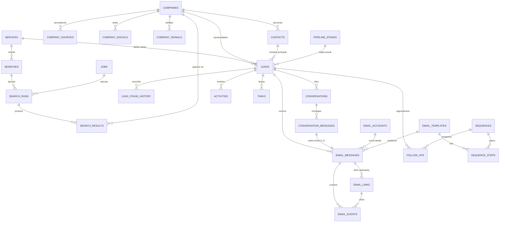
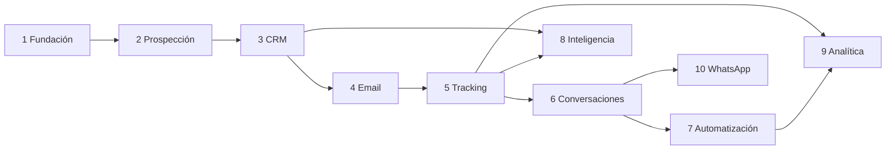

# CRM de Prospección y Conversión — Diseño de Arquitectura

**Estado:** Propuesta de diseño, revisión 2. Nada implementado todavía.
**Fecha:** 2026-07-27
**Alcance MVP:** Usuario único. Arquitectura preparada para multiusuario/multi-tenant sin reescritura.

**Parámetros confirmados por el usuario (rev. 2):**
| Parámetro | Valor |
|---|---|
| Mercado | Colombia (COP, +57, es-CO, America/Bogota) |
| Canales de email | **Gmail API + Outlook/Graph API vía OAuth** + SMTP/IMAP como alternativa |
| Volumen objetivo | **100 correos/día** |
| Canales futuros | **WhatsApp** (confirmado en roadmap) |
| Descubrimiento | **Scraper propio de Google Maps, construido desde cero** (proveedor por defecto) |

---

## 0. Resumen ejecutivo y decisiones clave

El sistema es un **pipeline de datos comerciales** con una capa CRM encima. El corazón no es el CRM: es el motor de descubrimiento → enriquecimiento → calificación → contacto → tracking → conversación.

### Decisiones de arquitectura (y por qué)

| # | Decisión | Alternativa descartada | Razón |
|---|---|---|---|
| D1 | FastAPI en capas Router → Controller → Service → Repository | Todo en el router | Testabilidad; el Service es reutilizable desde workers |
| D2 | Jobs en tabla `jobs` + `JobQueue` (Protocol) con impl. `InProcessQueue` (BackgroundTasks) | Celery/Redis desde día 1 | MVP sin infra extra; swap a ARQ = cambiar 1 clase |
| D3 | ARQ (no Celery) como cola futura | Celery | ARQ es async-nativo, encaja con SQLAlchemy 2.x async |
| D4 | **Scraper propio de Google Maps como proveedor por defecto**, detrás de `DiscoveryProvider` | Places API como única fuente | Decisión del usuario (rev. 2). Sin coste por request y devuelve campos que la API no expone. Places API y Apify quedan como proveedores alternativos por si el scraper se rompe. Diseño completo en §4.8 |
| D5 | Kanban configurable (`pipeline_stages`) + `stage_type` enum fijo | Solo etapas libres | Las métricas del funnel necesitan semántica estable aunque el usuario renombre etapas |
| D6 | **`conversation_messages` desde el día 1** (canal-agnóstico) + `email_messages` como sobre del canal email | Fusionar todo en `email_messages` | Revertido en rev. 2: WhatsApp confirmado en roadmap. Crear la tabla ahora cuesta un JOIN; crearla después cuesta una migración con backfill sobre datos vivos |
| D7 | `email_tracking` fusionada en `email_links` + contadores en `email_messages` | Tabla genérica de tracking | Menos indirección; `email_events` sigue siendo el log inmutable |
| D8 | `lead_stage_history` (tabla nueva, no pedida) | Calcular funnel desde `activities` | Sin ella no hay velocidad de embudo ni conversión por etapa |
| D9 | `suppression_list` + `unsubscribe_token` obligatorios desde Fase 4 | Añadirlo después | El cumplimiento no es retrofit; rompe el modelo si llega tarde |
| D10 | IA con Anthropic Claude (`claude-opus-5` por defecto) | Regex/plantillas fijas | Personalización y clasificación de respuestas. Detalle y costes en §12 |
| D11 | Frontend Next.js 15 + TS + Tailwind + shadcn/ui, separado del backend | Jinja/HTMX server-rendered | Kanban drag&drop e inbox en tiempo real piden SPA |
| D12 | `owner_id` (nullable, default NULL) en tablas raíz desde el día 1 | Añadir multi-tenancy después | Una columna nullable ahora = migración trivial mañana; sin ella hay que tocar 24 tablas |
| D13 | **`MailProvider` Protocol** con impls. Gmail API, Microsoft Graph y SMTP/IMAP; tabla `email_accounts` | Solo SMTP | Confirmado en rev. 2. Gmail/Graph dan threading nativo, push de respuestas (no polling) y mejor entregabilidad que SMTP crudo |
| D14 | **`ChannelAdapter` Protocol** (email hoy, WhatsApp/LinkedIn mañana) | Lógica de email hardcodeada en los services | Consecuencia de D6. `ConversationService` no sabe de SMTP ni de WhatsApp: habla con adaptadores |
| D15 | Defaults Colombia: COP, `+57`, `America/Bogota`, `es-CO` | Configurable pero sin default | Menos fricción; sigue siendo configurable en `app_settings` |

### Nota sobre extracción de datos

El scraper propio de Google Maps queda como **proveedor por defecto**, según lo decidido en rev. 2. El diseño lo trata como componente de primera clase (§4.8), no como plug-in secundario. Señalo una vez, para que conste, y sigo: raspar Google Maps va contra los Términos de Servicio de Google, y el scraper es frágil por naturaleza — un cambio de DOM lo rompe. Por eso el diseño mantiene los otros dos proveedores implementados detrás del mismo `Protocol`: si el scraper cae un martes, se cambia una línea en configuración y la prospección sigue funcionando esa misma tarde.

Alcance del scraping, en concreto:

- **Google Maps:** scraper propio con Playwright + parsing adaptativo estilo Scrapling. Extrae los 18 campos del Módulo 3. Detalle en §4.8.
- **Sitios web de las empresas:** crawler propio, respeta `robots.txt`, 1 req/s por dominio. Es la fuente real de los emails.
- **Instagram / Facebook:** se descubre la URL desde el sitio web y desde Google Maps. Datos de perfil (seguidores, último post) solo si el usuario conecta la Graph API oficial.
- **LinkedIn:** solo se almacena la URL descubierta. No se implementa scraping de LinkedIn — es el único caso con litigio real de por medio y con detección agresiva que quemaría la infraestructura sin aportar el dato clave (el email casi nunca está ahí; está en el sitio web de la empresa, que sí raspamos).
- **No se implementa** bypass de CAPTCHA. Si Google presenta un challenge, el job se pausa y avisa al usuario en la UI, en lugar de intentar resolverlo.

---

## 1. Arquitectura general

### 1.1 Capas

```
HTTP Request
    ↓
Router          → define ruta, valida schema Pydantic, inyecta deps
    ↓
Controller      → orquesta 1 caso de uso, traduce excepciones → HTTP
    ↓
Service         → lógica de negocio, transacciones, reglas
    ↓
Repository      → acceso a datos, queries SQLAlchemy
    ↓
SQLAlchemy 2.x (async)
    ↓
PostgreSQL 16
```

**Regla dura:** el Router nunca importa un Repository. El Service nunca importa `Request`/`Response` de FastAPI. El Repository nunca contiene lógica de negocio.

### 1.2 Procesos pesados (fuera del request HTTP)

```
POST /searches/{id}/run
    ↓
SearchController.run()
    ↓
JobService.enqueue(JobType.DISCOVERY, payload)   → INSERT en jobs (status=QUEUED)
    ↓
[respuesta HTTP 202 { job_id }]  ←─── el usuario ya tiene respuesta

--- asíncrono ---
JobQueue.dispatch()
    ↓
DiscoveryWorker
    ↓ DiscoveryProvider.search()      (Places API / scraper / Apify)
    ↓ CompanyService.upsert_batch()   (dedupe)
    ↓ JobService.enqueue(ENRICHMENT)  (encadena siguiente job)
    ↓
EnrichmentWorker
    ↓ WebsiteCrawler → emails, teléfonos, redes, señales
    ↓ SignalDetector → company_signals
    ↓ JobService.enqueue(SCORING)
    ↓
ScoringWorker
    ↓ ScoreEngine → leads.score + score_breakdown
    ↓
[job COMPLETED]
```

El frontend hace polling a `GET /jobs/{id}` (o SSE en `GET /jobs/{id}/stream`) para la barra de progreso.

### 1.3 Abstracción de la cola

```python
# app/core/jobs.py
class JobQueue(Protocol):
    async def enqueue(self, job_type: JobType, payload: dict) -> UUID: ...
    async def cancel(self, job_id: UUID) -> None: ...

class InProcessQueue(JobQueue):   # MVP — usa asyncio.TaskGroup + BackgroundTasks
    ...

class ArqQueue(JobQueue):         # Fase 7+ — Redis
    ...
```

Cambiar de MVP a producción = cambiar una línea en `app/core/container.py`. Los workers no cambian.

### 1.4 Los workers son Services, no scripts

Cada worker es una clase con un método `run(job: Job) -> JobResult`. Se puede invocar:
- desde la cola (producción),
- desde un test (unitario, sin HTTP),
- desde un comando CLI (`python -m app.cli run-job <id>`) para debugging.

---

## 2. Stack y estructura de carpetas

### 2.1 Stack

**Backend**
- Python 3.12+
- FastAPI + Uvicorn
- Pydantic v2 (schemas + `pydantic-settings` para config)
- SQLAlchemy 2.x (estilo `Mapped[]`, sesión async con `asyncpg`)
- Alembic (migraciones)
- PostgreSQL 16 (`pg_trgm` para dedupe difuso, `citext` para emails, `earthdistance`/`cube` o PostGIS para radio geográfico)
- `playwright` (navegador headless — **núcleo del scraper**, no opcional), `scrapling` (parsing adaptativo con auto-match de selectores), `selectolax` (parseo HTML rápido para el crawler de sitios web), `httpx` (cliente HTTP async)
- `phonenumbers` (normalización E.164 con región CO), `tldextract` (canonicalización de dominios)
- **Email — 3 proveedores:**
  - `google-api-python-client` + `google-auth-oauthlib` (Gmail API)
  - `msal` + Microsoft Graph vía `httpx` (Outlook / Microsoft 365)
  - `aiosmtplib` + `aioimaplib` (SMTP/IMAP genérico, fallback)
- `anthropic` SDK (IA)
- `structlog` (logging estructurado)
- `pytest` + `pytest-asyncio` + `testcontainers` (Postgres real en tests)

**Frontend**
- Next.js 15 (App Router) + TypeScript
- Tailwind CSS v4 + shadcn/ui
- TanStack Query v5 (server state)
- `@dnd-kit` (Kanban drag & drop)
- Recharts (dashboard)
- `zod` (validación cliente, espejo de los schemas Pydantic)

**Infra local**
- Docker Compose: `postgres`, `mailhog` (SMTP de pruebas), luego `redis`

### 2.2 Estructura

```
crm/
├── docker-compose.yml
├── README.md
├── docs/
│   └── ARQUITECTURA.md              ← este archivo
│
├── backend/
│   ├── pyproject.toml
│   ├── alembic.ini
│   ├── .env.example
│   │
│   ├── app/
│   │   ├── main.py                  # crea la app, monta routers, middlewares
│   │   │
│   │   ├── core/
│   │   │   ├── config.py            # Settings (pydantic-settings)
│   │   │   ├── database.py          # engine, session factory, get_db()
│   │   │   ├── container.py         # wiring de dependencias (JobQueue, providers)
│   │   │   ├── security.py          # tokens de tracking/unsubscribe, hashing
│   │   │   ├── logging.py           # structlog
│   │   │   ├── exceptions.py        # DomainError, NotFound, Conflict, RateLimited
│   │   │   ├── jobs.py              # JobQueue Protocol + InProcessQueue
│   │   │   └── enums.py             # todos los Enum compartidos
│   │   │
│   │   ├── models/                  # SQLAlchemy — 1 archivo por agregado
│   │   │   ├── base.py              # Base, TimestampMixin, UUIDMixin, OwnerMixin
│   │   │   ├── service.py
│   │   │   ├── search.py            # Search, SearchRun, SearchResult
│   │   │   ├── company.py           # Company, CompanySource, CompanySocial, CompanySignal
│   │   │   ├── contact.py
│   │   │   ├── lead.py              # Lead, LeadStageHistory
│   │   │   ├── pipeline.py          # PipelineStage
│   │   │   ├── email.py             # EmailTemplate, EmailMessage, EmailLink, EmailEvent
│   │   │   ├── email_account.py     # EmailAccount (Gmail / Graph / SMTP)   ← D13
│   │   │   ├── conversation.py      # Conversation, ConversationMessage     ← D6
│   │   │   ├── sequence.py          # Sequence, SequenceStep, FollowUp
│   │   │   ├── activity.py
│   │   │   ├── task.py
│   │   │   ├── suppression.py
│   │   │   ├── job.py
│   │   │   └── settings.py          # AppSettings (singleton)
│   │   │
│   │   ├── schemas/                 # Pydantic — In/Out por recurso
│   │   │   ├── common.py            # Page[T], ErrorOut, IdOut
│   │   │   └── ... (uno por modelo)
│   │   │
│   │   ├── repositories/
│   │   │   ├── base.py              # BaseRepository[Model] (get, list, create...)
│   │   │   └── ... (uno por agregado)
│   │   │
│   │   ├── services/
│   │   │   ├── service_svc.py       # catálogo de servicios que vende el usuario
│   │   │   ├── search_svc.py
│   │   │   ├── company_svc.py       # incluye upsert + dedupe
│   │   │   ├── contact_svc.py
│   │   │   ├── lead_svc.py
│   │   │   ├── pipeline_svc.py
│   │   │   ├── email_svc.py
│   │   │   ├── template_svc.py
│   │   │   ├── conversation_svc.py
│   │   │   ├── sequence_svc.py
│   │   │   ├── activity_svc.py
│   │   │   ├── task_svc.py
│   │   │   ├── metrics_svc.py
│   │   │   └── job_svc.py
│   │   │
│   │   ├── controllers/             # uno por router
│   │   │
│   │   ├── routers/
│   │   │   ├── __init__.py          # api_router agrega todos
│   │   │   ├── services.py          ... etc
│   │   │   └── tracking.py          # público, sin auth (pixel, click, unsubscribe)
│   │   │
│   │   ├── scrapers/
│   │   │   ├── base.py              # DiscoveryProvider Protocol + DTO RawPlace
│   │   │   ├── registry.py
│   │   │   ├── google_maps/         # ★ DEFAULT — scraper propio (§4.8)
│   │   │   │   ├── provider.py      # orquesta: query → scroll → detalle
│   │   │   │   ├── browser.py       # pool de contextos Playwright, ciclo de vida
│   │   │   │   ├── search_page.py   # construcción de URL, scroll infinito del listado
│   │   │   │   ├── detail_page.py   # panel de detalle → RawPlace
│   │   │   │   ├── selectors.py     # selectores versionados + fallbacks en cascada
│   │   │   │   ├── parsers.py       # horarios, rating, reseñas, coords desde URL
│   │   │   │   └── health.py        # autodiagnóstico: ¿siguen sirviendo los selectores?
│   │   │   ├── google_places_api.py # alternativa oficial
│   │   │   └── apify_provider.py    # alternativa gestionada
│   │   │
│   │   ├── enrichment/
│   │   │   ├── website_crawler.py   # robots.txt, rate limit, /contacto /about
│   │   │   ├── extractors.py        # email, teléfono, redes (regex + microdata)
│   │   │   ├── email_verifier.py    # sintaxis, MX, rol, catch-all
│   │   │   └── signal_detector.py   # sin web, no responsive, sin SSL, sin WhatsApp...
│   │   │
│   │   ├── scoring/
│   │   │   ├── engine.py            # orquesta las 6 dimensiones
│   │   │   └── dimensions.py        # fit, opportunity, contactability, ...
│   │   │
│   │   ├── channels/                # ← D14: abstracción multi-canal
│   │   │   ├── base.py              # ChannelAdapter Protocol (send, fetch, thread_key)
│   │   │   ├── email_adapter.py     # implementación email (usa mail/)
│   │   │   └── whatsapp_adapter.py  # stub documentado, Fase 10
│   │   │
│   │   ├── mail/                    # ← D13: proveedores de correo
│   │   │   ├── base.py              # MailProvider Protocol
│   │   │   ├── gmail.py             # Gmail API: send, history.list, watch
│   │   │   ├── graph.py             # Microsoft Graph: sendMail, subscriptions
│   │   │   ├── smtp.py              # aiosmtplib + aioimaplib (fallback)
│   │   │   ├── oauth.py             # flujo OAuth, refresh, revocación
│   │   │   ├── renderer.py          # plantillas + variables {{...}}
│   │   │   ├── builder.py           # MIME, pixel, reescritura de links, headers
│   │   │   ├── threading.py         # Message-ID / References / threadId
│   │   │   ├── bounce_parser.py     # DSN RFC 3464 + códigos de Gmail/Graph
│   │   │   └── guardrails.py        # supresión, límites, warm-up
│   │   │
│   │   ├── ai/
│   │   │   ├── client.py            # wrapper del SDK anthropic
│   │   │   ├── personalizer.py      # genera asunto/cuerpo
│   │   │   └── reply_classifier.py  # clasifica respuestas entrantes
│   │   │
│   │   ├── workers/
│   │   │   ├── discovery_worker.py
│   │   │   ├── enrichment_worker.py
│   │   │   ├── scoring_worker.py
│   │   │   ├── send_worker.py
│   │   │   ├── inbox_worker.py      # Gmail history / Graph delta / IMAP poll
│   │   │   ├── token_refresh_worker.py  # renueva OAuth antes de expirar
│   │   │   └── followup_worker.py   # scheduler de secuencias
│   │   │
│   │   └── utils/
│   │       ├── text.py              # normalización nombres, slugify
│   │       ├── phone.py             # E.164 región CO (phonenumbers)
│   │       ├── url.py               # canonicalización de dominio
│   │       └── dedupe.py            # dedupe_key, similitud trigram
│   │
│   ├── migrations/
│   └── tests/
│       ├── conftest.py
│       ├── unit/
│       └── integration/
│
└── frontend/
    ├── package.json
    ├── app/
    │   ├── (dashboard)/page.tsx
    │   ├── prospects/
    │   ├── companies/
    │   ├── contacts/
    │   ├── searches/
    │   ├── services/
    │   ├── pipeline/
    │   ├── conversations/
    │   ├── emails/
    │   ├── templates/
    │   ├── follow-ups/
    │   ├── tasks/
    │   └── settings/
    ├── components/
    │   ├── ui/                      # shadcn
    │   ├── kanban/
    │   ├── inbox/
    │   └── charts/
    └── lib/
        ├── api.ts                   # cliente tipado
        └── types.ts                 # generados desde OpenAPI
```

---

## 3. Modelo de datos PostgreSQL

### 3.1 Enums (tipos nativos PG)

```sql
CREATE TYPE stage_type AS ENUM (
  'NEW','QUALIFIED','CONTACT_FOUND','CONTACTED','OPENED','REPLIED',
  'CONVERSATION','INTERESTED','MEETING','OPPORTUNITY','PROPOSAL',
  'NEGOTIATION','WON','LOST'
);

CREATE TYPE lead_status AS ENUM ('OPEN','WON','LOST','DISQUALIFIED','PAUSED');

CREATE TYPE source_type AS ENUM (
  'GOOGLE_MAPS','GOOGLE_PLACES_API','WEBSITE','LINKEDIN','INSTAGRAM',
  'FACEBOOK','MANUAL','AI','IMPORT'
);

CREATE TYPE verification_status AS ENUM (
  'UNVERIFIED','SYNTAX_OK','MX_OK','VERIFIED','RISKY','INVALID','BOUNCED'
);

CREATE TYPE email_status AS ENUM (
  'DRAFT','QUEUED','SENDING','SENT','DELIVERED','BOUNCED','FAILED','CANCELLED'
);

CREATE TYPE email_event_type AS ENUM (
  'SENT','DELIVERED','OPENED','CLICKED','REPLIED','BOUNCED',
  'COMPLAINED','UNSUBSCRIBED','FAILED'
);

CREATE TYPE direction AS ENUM ('OUTBOUND','INBOUND');

-- D6 / D14 — multicanal
CREATE TYPE channel AS ENUM ('EMAIL','WHATSAPP','LINKEDIN','PHONE','MANUAL');

-- D13 — proveedores de correo
CREATE TYPE mail_provider AS ENUM ('GMAIL','MICROSOFT','SMTP');
CREATE TYPE account_status AS ENUM ('ACTIVE','TOKEN_EXPIRED','REVOKED','ERROR','DISABLED');

CREATE TYPE reply_intent AS ENUM (
  'POSITIVE','NEUTRAL','NEGATIVE','QUESTION','PRICING','MEETING_REQUEST',
  'OUT_OF_OFFICE','UNSUBSCRIBE','WRONG_PERSON','UNKNOWN'
);

CREATE TYPE job_type AS ENUM (
  'DISCOVERY','ENRICHMENT','SCORING','SEND_BATCH','INBOX_SYNC','FOLLOWUP_TICK'
);

CREATE TYPE job_status AS ENUM ('QUEUED','RUNNING','COMPLETED','FAILED','CANCELLED');

CREATE TYPE activity_type AS ENUM (
  'COMPANY_FOUND','EMAIL_FOUND','LEAD_CREATED','LEAD_QUALIFIED','STAGE_CHANGED',
  'EMAIL_SENT','EMAIL_DELIVERED','EMAIL_OPENED','EMAIL_CLICKED','EMAIL_REPLIED',
  'EMAIL_BOUNCED','CONVERSATION_STARTED','FOLLOWUP_SCHEDULED','FOLLOWUP_SENT',
  'MEETING_SCHEDULED','PROPOSAL_SENT','NOTE','TASK_CREATED','TASK_COMPLETED',
  'AI_PERSONALIZED','AI_CLASSIFIED','WON','LOST'
);

CREATE TYPE actor_type AS ENUM ('USER','SYSTEM','AI','PROSPECT');
```

### 3.2 Mixins comunes

Todas las tablas raíz llevan:

```sql
id            UUID PRIMARY KEY DEFAULT gen_random_uuid(),
owner_id      UUID NULL,                    -- ← futuro multiusuario. NULL en MVP.
created_at    TIMESTAMPTZ NOT NULL DEFAULT now(),
updated_at    TIMESTAMPTZ NOT NULL DEFAULT now()
```

`owner_id` nullable desde el día 1 es la única concesión al multi-tenancy futuro. Cuando llegue, se hace `NOT NULL` + índices compuestos + un `RowLevelSecurity` o un filtro en `BaseRepository`. Sin esta columna hoy, esa migración toca 20 tablas y todo el código de queries.

---

### 3.3 Tablas

#### `app_settings` (fila única)

```sql
id                      SMALLINT PRIMARY KEY DEFAULT 1 CHECK (id = 1),

-- Identidad del remitente (la cuenta técnica vive en email_accounts)
sender_name             TEXT NOT NULL,
default_account_id      UUID REFERENCES email_accounts(id) ON DELETE SET NULL,
reply_to                CITEXT,
tracking_domain         TEXT,                     -- ej. track.midominio.com

-- Localización — defaults Colombia (D15)
country_code            CHAR(2)  NOT NULL DEFAULT 'CO',
phone_region            CHAR(2)  NOT NULL DEFAULT 'CO',   -- para phonenumbers
currency                CHAR(3)  NOT NULL DEFAULT 'COP',
locale                  TEXT     NOT NULL DEFAULT 'es-CO',
timezone                TEXT     NOT NULL DEFAULT 'America/Bogota',
address_of_sender       TEXT,                     -- obligatorio en el footer legal

-- Límites de envío (objetivo: 100/día)
daily_send_limit        INT NOT NULL DEFAULT 100,
hourly_send_limit       INT NOT NULL DEFAULT 20,
min_seconds_between     INT NOT NULL DEFAULT 45,
send_window_start       TIME NOT NULL DEFAULT '08:00',
send_window_end         TIME NOT NULL DEFAULT '18:00',
skip_weekends           BOOLEAN NOT NULL DEFAULT TRUE,
warmup_enabled          BOOLEAN NOT NULL DEFAULT TRUE,
warmup_started_on       DATE,                     -- rampa 20 → 100, ver §14

-- IA
ai_enabled              BOOLEAN NOT NULL DEFAULT TRUE,
ai_model                TEXT NOT NULL DEFAULT 'claude-opus-5',
ai_tone                 TEXT NOT NULL DEFAULT 'usted',   -- usted | tuteo

-- Descubrimiento (D4 — scraper propio por defecto)
discovery_provider      TEXT NOT NULL DEFAULT 'google_maps_scraper',
scraper_concurrency     SMALLINT NOT NULL DEFAULT 2,
scraper_delay_ms_min    INT NOT NULL DEFAULT 1200,
scraper_delay_ms_max    INT NOT NULL DEFAULT 3500,
scraper_headless        BOOLEAN NOT NULL DEFAULT TRUE,
google_places_key_enc   TEXT,                     -- proveedor alternativo
apify_token_enc         TEXT,                     -- proveedor alternativo

-- Scoring
score_weights           JSONB NOT NULL DEFAULT
  '{"fit":0.30,"opportunity":0.25,"contactability":0.20,
    "data_quality":0.10,"intent":0.10,"timing":0.05}',

automations_paused      BOOLEAN NOT NULL DEFAULT FALSE,   -- kill switch global
created_at, updated_at
```

#### `email_accounts` — buzones conectados (D13)

```sql
id, owner_id
provider              mail_provider NOT NULL,     -- GMAIL | MICROSOFT | SMTP
email                 CITEXT NOT NULL,
display_name          TEXT,
status                account_status NOT NULL DEFAULT 'ACTIVE',

-- OAuth (GMAIL / MICROSOFT) — cifrado con Fernet
oauth_access_token_enc   TEXT,
oauth_refresh_token_enc  TEXT,
oauth_expires_at         TIMESTAMPTZ,
oauth_scopes             TEXT[],
external_account_id      TEXT,                    -- sub de Google / id de Graph

-- SMTP/IMAP (provider = SMTP)
smtp_host             TEXT, smtp_port INT, smtp_user TEXT,
smtp_password_enc     TEXT, smtp_use_tls BOOLEAN DEFAULT TRUE,
imap_host             TEXT, imap_port INT, imap_user TEXT,
imap_password_enc     TEXT,

-- Sincronización de entrada
sync_cursor           TEXT,        -- historyId (Gmail) / deltaLink (Graph) / UID (IMAP)
last_synced_at        TIMESTAMPTZ,
watch_expires_at      TIMESTAMPTZ, -- Gmail watch / Graph subscription caducan
sync_error            TEXT,

-- Contadores de envío (reset diario/horario por el guardrail)
sent_today            INT NOT NULL DEFAULT 0,
sent_this_hour        INT NOT NULL DEFAULT 0,
counters_reset_at     TIMESTAMPTZ,

is_default            BOOLEAN NOT NULL DEFAULT FALSE,
created_at, updated_at

UNIQUE INDEX ON email_accounts (owner_id, lower(email));
INDEX ON email_accounts (status) WHERE status != 'ACTIVE';
INDEX ON email_accounts (watch_expires_at) WHERE watch_expires_at IS NOT NULL;
```

Los tokens **nunca** salen en las respuestas de la API. El schema Pydantic de salida expone solo `id, provider, email, display_name, status, is_default, last_synced_at`.

#### `services` — qué vende el usuario (Módulo 1)

```sql
id, owner_id
name                  TEXT NOT NULL,
description           TEXT,
ideal_customer        TEXT,                       -- "PYMES"
target_industries     TEXT[] NOT NULL DEFAULT '{}',
problems_solved       TEXT[] NOT NULL DEFAULT '{}',
opportunity_signals   TEXT[] NOT NULL DEFAULT '{}',  -- claves de company_signals
value_proposition     TEXT,
price_from            NUMERIC(12,2),
currency              CHAR(3) DEFAULT 'COP',
is_active             BOOLEAN NOT NULL DEFAULT TRUE,
created_at, updated_at

UNIQUE (owner_id, lower(name))
```

`opportunity_signals` guarda **claves** (`no_website`, `not_responsive`, `no_whatsapp`, …), no texto libre, para que el motor de scoring pueda cruzarlas contra `company_signals`.

#### `searches` — configuración de búsqueda (Módulo 2)

```sql
id, owner_id
service_id            UUID REFERENCES services(id) ON DELETE SET NULL,
name                  TEXT NOT NULL,
business_type         TEXT NOT NULL,              -- "Restaurantes"
keywords              TEXT[] NOT NULL DEFAULT '{}',
country               TEXT, region TEXT, city TEXT NOT NULL, zone TEXT,
latitude              DOUBLE PRECISION,
longitude             DOUBLE PRECISION,
radius_km             NUMERIC(6,2) DEFAULT 10,
target_count          INT NOT NULL DEFAULT 100,
source                source_type NOT NULL DEFAULT 'GOOGLE_PLACES_API',
min_rating            NUMERIC(2,1),
max_reviews           INT,                        -- filtro: negocios pequeños
exclude_chains        BOOLEAN DEFAULT FALSE,
auto_enrich           BOOLEAN NOT NULL DEFAULT TRUE,
auto_score            BOOLEAN NOT NULL DEFAULT TRUE,
is_active             BOOLEAN NOT NULL DEFAULT TRUE,
created_at, updated_at
```

#### `search_runs` — cada ejecución

```sql
id,
search_id             UUID NOT NULL REFERENCES searches(id) ON DELETE CASCADE,
job_id                UUID REFERENCES jobs(id),
status                job_status NOT NULL DEFAULT 'QUEUED',
provider              source_type NOT NULL,
results_found         INT NOT NULL DEFAULT 0,
results_new           INT NOT NULL DEFAULT 0,
results_duplicate     INT NOT NULL DEFAULT 0,
error_message         TEXT,
started_at, finished_at, created_at

INDEX (search_id, created_at DESC)
```

#### `search_results` — trazabilidad búsqueda ↔ empresa

```sql
search_run_id         UUID NOT NULL REFERENCES search_runs(id) ON DELETE CASCADE,
company_id            UUID NOT NULL REFERENCES companies(id) ON DELETE CASCADE,
is_new                BOOLEAN NOT NULL,
position              INT,
raw_payload           JSONB,                      -- respuesta cruda del provider
PRIMARY KEY (search_run_id, company_id)
```

Guardar `raw_payload` permite reprocesar sin volver a llamar al proveedor (ahorra cuota y dinero).

#### `companies` (Módulos 3 y 5)

```sql
id, owner_id
name                  TEXT NOT NULL,
legal_name            TEXT,
description           TEXT,
category              TEXT,                       -- categoría primaria del proveedor
categories            TEXT[] DEFAULT '{}',
address               TEXT,
city                  TEXT, state TEXT, country TEXT, postal_code TEXT,
phone                 TEXT,                       -- E.164
phone_raw             TEXT,
email                 CITEXT,                     -- email principal (denormalizado)
website               TEXT,
website_domain        TEXT,                       -- canonicalizado: "empresa.com"
google_maps_url       TEXT,
google_ftid           TEXT,                       -- del scraper: "0x8e442e...:0x9f1b..."
google_place_id       TEXT,                       -- de Places API: "ChIJ..."
latitude              DOUBLE PRECISION,
longitude             DOUBLE PRECISION,
rating                NUMERIC(2,1),
reviews_count         INT,
price_level           SMALLINT,
opening_hours         JSONB,                      -- {"mon":[["09:00","18:00"]], ...}
is_permanently_closed BOOLEAN NOT NULL DEFAULT FALSE,
employee_range        TEXT,
data_quality_score    SMALLINT NOT NULL DEFAULT 0,   -- 0-100, calculado
dedupe_key            TEXT NOT NULL,                 -- ver §4.3
first_extracted_at    TIMESTAMPTZ NOT NULL,
last_extracted_at     TIMESTAMPTZ NOT NULL,
last_enriched_at      TIMESTAMPTZ,
created_at, updated_at

UNIQUE INDEX ON companies (google_ftid)     WHERE google_ftid IS NOT NULL;
UNIQUE INDEX ON companies (google_place_id) WHERE google_place_id IS NOT NULL;
UNIQUE INDEX ON companies (owner_id, dedupe_key);
INDEX ON companies (website_domain) WHERE website_domain IS NOT NULL;
INDEX ON companies USING gin (name gin_trgm_ops);
INDEX ON companies (city, category);
INDEX ON companies USING gist (ll_to_earth(latitude, longitude));  -- radio
```

Sobre los campos que pediste explícitamente:
- *Nombre* → `name`
- *Descripción negocio* → `description` + `category`/`categories`
- *Ubicación* → `address`, `city`, `state`, `country`, `latitude`, `longitude`
- *Teléfono* → `phone` (normalizado E.164) + `phone_raw`
- *Correo* → `company_sources` (con procedencia) y `email` como principal
- *Link Google Maps* → `google_maps_url` + `google_place_id`
- *Link redes* → `company_socials`
- *Fecha extracción* → `first_extracted_at` / `last_extracted_at`

#### `company_sources` — procedencia por dato (Módulo 4)

```sql
id,
company_id            UUID NOT NULL REFERENCES companies(id) ON DELETE CASCADE,
field_name            TEXT NOT NULL,              -- 'email','phone','website','address'
value                 TEXT NOT NULL,
source                source_type NOT NULL,
source_url            TEXT,
confidence            SMALLINT NOT NULL DEFAULT 50,   -- 0-100
verification          verification_status NOT NULL DEFAULT 'UNVERIFIED',
is_primary            BOOLEAN NOT NULL DEFAULT FALSE,
extracted_at          TIMESTAMPTZ NOT NULL DEFAULT now(),
created_at

UNIQUE (company_id, field_name, value)
INDEX (company_id, field_name)
```

Esto responde literalmente a lo que pediste:
```
Email: ventas@empresa.com
Fuente: WEBSITE
URL: empresa.com/contacto
Estado: MX_OK
```

#### `company_socials`

```sql
id,
company_id            UUID NOT NULL REFERENCES companies(id) ON DELETE CASCADE,
platform              TEXT NOT NULL,   -- instagram|facebook|linkedin|x|tiktok|youtube|whatsapp
url                   TEXT NOT NULL,
handle                TEXT,
followers_count       INT,
last_post_at          TIMESTAMPTZ,
source                source_type NOT NULL,
extracted_at          TIMESTAMPTZ NOT NULL DEFAULT now(),
created_at, updated_at

UNIQUE (company_id, platform, url)
```

#### `company_signals` — señales de oportunidad

```sql
id,
company_id            UUID NOT NULL REFERENCES companies(id) ON DELETE CASCADE,
signal_key            TEXT NOT NULL,   -- 'no_website','not_responsive','no_ssl',
                                       -- 'slow_site','outdated_site','no_whatsapp',
                                       -- 'no_contact_form','no_instagram','low_reviews',
                                       -- 'no_photos','stale_social'
value                 JSONB,           -- {"lcp_ms":4200} / {"copyright_year":2016}
detected_at           TIMESTAMPTZ NOT NULL DEFAULT now(),
source                source_type NOT NULL,

UNIQUE (company_id, signal_key)
INDEX (signal_key)
```

Esta tabla es la que convierte el CRM en *inteligencia comercial*: sin ella, "necesita página web" es una corazonada; con ella, es un dato con fecha y evidencia.

#### `contacts` (Módulo 6)

```sql
id, owner_id
company_id            UUID NOT NULL REFERENCES companies(id) ON DELETE CASCADE,
first_name            TEXT,
last_name             TEXT,
full_name             TEXT,
job_title             TEXT,
seniority             TEXT,                       -- owner|c_level|manager|staff
email                 CITEXT,
email_verified        verification_status NOT NULL DEFAULT 'UNVERIFIED',
is_role_email         BOOLEAN NOT NULL DEFAULT FALSE,  -- info@, contacto@
phone                 TEXT,
whatsapp              TEXT,
linkedin_url          TEXT,
source                source_type NOT NULL,
is_primary            BOOLEAN NOT NULL DEFAULT FALSE,
do_not_contact        BOOLEAN NOT NULL DEFAULT FALSE,
notes                 TEXT,
created_at, updated_at

UNIQUE INDEX ON contacts (company_id, lower(email)) WHERE email IS NOT NULL;
INDEX ON contacts (company_id);
INDEX ON contacts (lower(email));
```

#### `pipeline_stages` — Kanban configurable

```sql
id, owner_id
name                  TEXT NOT NULL,              -- editable por el usuario
stage_key             TEXT NOT NULL,              -- slug estable
stage_type            stage_type NOT NULL,        -- semántica fija para métricas
position              INT NOT NULL,
color                 TEXT NOT NULL DEFAULT '#64748b',
is_default            BOOLEAN NOT NULL DEFAULT FALSE,
is_won                BOOLEAN NOT NULL DEFAULT FALSE,
is_lost               BOOLEAN NOT NULL DEFAULT FALSE,
is_system             BOOLEAN NOT NULL DEFAULT FALSE,  -- no borrable
auto_advance_on       TEXT[],                     -- ['EMAIL_OPENED','EMAIL_REPLIED']
created_at, updated_at

UNIQUE (owner_id, stage_key)
UNIQUE (owner_id, position) DEFERRABLE INITIALLY DEFERRED
```

**Esta es la decisión D5 en acción.** El usuario puede renombrar "PRIMER CONTACTO" a "Primer toque", moverla, cambiarle color. Pero `stage_type = 'CONTACTED'` no cambia, y las métricas del funnel se calculan sobre `stage_type`, no sobre `name`. Sin esto, renombrar una columna rompe el dashboard.

Seed inicial (14 etapas, exactamente las que definiste):

| pos | name | stage_key | stage_type |
|---|---|---|---|
| 1 | Prospecto | prospect | NEW |
| 2 | Calificado | qualified | QUALIFIED |
| 3 | Contacto encontrado | contact_found | CONTACT_FOUND |
| 4 | Primer contacto | first_contact | CONTACTED |
| 5 | Email abierto | opened | OPENED |
| 6 | Respondió | replied | REPLIED |
| 7 | Conversación | conversation | CONVERSATION |
| 8 | Interesado | interested | INTERESTED |
| 9 | Reunión | meeting | MEETING |
| 10 | Oportunidad | opportunity | OPPORTUNITY |
| 11 | Propuesta | proposal | PROPOSAL |
| 12 | Negociación | negotiation | NEGOTIATION |
| 13 | Ganado | won | WON (`is_won`) |
| 14 | Perdido | lost | LOST (`is_lost`) |

#### `leads` (Módulo 7) — el corazón del CRM

```sql
id, owner_id
company_id            UUID NOT NULL REFERENCES companies(id) ON DELETE CASCADE,
service_id            UUID NOT NULL REFERENCES services(id) ON DELETE RESTRICT,
contact_id            UUID REFERENCES contacts(id) ON DELETE SET NULL,  -- principal
stage_id              UUID NOT NULL REFERENCES pipeline_stages(id),
status                lead_status NOT NULL DEFAULT 'OPEN',

score                 SMALLINT NOT NULL DEFAULT 0,       -- 0-100
score_breakdown       JSONB,                             -- ver §8
score_computed_at     TIMESTAMPTZ,
engagement_score      SMALLINT NOT NULL DEFAULT 0,
engagement_band       TEXT GENERATED ALWAYS AS (
                        CASE WHEN engagement_score >= 40 THEN 'ALTO'
                             WHEN engagement_score >= 15 THEN 'MEDIO'
                             WHEN engagement_score >= 1  THEN 'BAJO'
                             ELSE 'FRIO' END) STORED,
reply_intent          reply_intent,

estimated_value       NUMERIC(12,2),
currency              CHAR(3) DEFAULT 'COP',

first_contact_at      TIMESTAMPTZ,
last_contact_at       TIMESTAMPTZ,
last_activity_at      TIMESTAMPTZ,
next_follow_up_at     TIMESTAMPTZ,
replied_at            TIMESTAMPTZ,
won_at                TIMESTAMPTZ,
lost_at               TIMESTAMPTZ,
lost_reason           TEXT,

sequence_id           UUID REFERENCES sequences(id) ON DELETE SET NULL,
sequence_step         SMALLINT NOT NULL DEFAULT 0,
sequence_paused       BOOLEAN NOT NULL DEFAULT FALSE,

created_at, updated_at

UNIQUE (company_id, service_id)     -- 1 lead por empresa+servicio
INDEX (stage_id, score DESC)
INDEX (next_follow_up_at) WHERE next_follow_up_at IS NOT NULL AND status = 'OPEN'
INDEX (owner_id, status, last_activity_at DESC)
```

La restricción `UNIQUE (company_id, service_id)` implementa tu ejemplo: *Restaurante X* puede tener Lead-web, Lead-fotografía, Lead-video — tres leads, misma empresa, servicios distintos. Pero no dos leads de "página web" duplicados.

#### `lead_stage_history` — tabla añadida (no estaba en tu lista)

```sql
id,
lead_id               UUID NOT NULL REFERENCES leads(id) ON DELETE CASCADE,
from_stage_id         UUID REFERENCES pipeline_stages(id),
to_stage_id           UUID NOT NULL REFERENCES pipeline_stages(id),
from_stage_type       stage_type,
to_stage_type         stage_type NOT NULL,
actor                 actor_type NOT NULL,
reason                TEXT,
entered_at            TIMESTAMPTZ NOT NULL DEFAULT now(),
duration_seconds      INT,                        -- tiempo en la etapa anterior

INDEX (lead_id, entered_at)
INDEX (to_stage_type, entered_at)
```

**Por qué la añado:** el Módulo 20 pide un embudo con conversión etapa a etapa (1.000 → 500 → 450 → …). Sin historial de etapas, solo puedes contar *dónde está cada lead ahora*, no *cuántos pasaron por cada etapa* ni *cuánto tardaron*. La foto actual no es un embudo; es un inventario. Esta tabla es la diferencia entre "tengo 8 interesados" y "de 150 aperturas, 8 llegaron a interesado en promedio 6 días — el cuello está entre apertura y respuesta".

#### `email_templates` (Módulo 10)

```sql
id, owner_id
name                  TEXT NOT NULL,
category              TEXT NOT NULL,   -- first_contact|followup_1|followup_2|
                                       -- reactivation|proposal|meeting
service_id            UUID REFERENCES services(id) ON DELETE SET NULL,
subject               TEXT NOT NULL,
body_text             TEXT NOT NULL,
body_html             TEXT,
variables_used        TEXT[] DEFAULT '{}',        -- extraído al guardar
is_active             BOOLEAN NOT NULL DEFAULT TRUE,
times_used            INT NOT NULL DEFAULT 0,
open_rate             NUMERIC(5,2),               -- materializado por job nocturno
reply_rate            NUMERIC(5,2),
created_at, updated_at
```

Variables soportadas: `{{company_name}}`, `{{contact_name}}`, `{{first_name}}`, `{{city}}`, `{{category}}`, `{{service_name}}`, `{{sender_name}}`, `{{website}}`, `{{signal_summary}}`, `{{unsubscribe_url}}`.

`{{unsubscribe_url}}` es **obligatorio**: el renderer rechaza guardar una plantilla sin ella (o la inyecta en el footer automáticamente).

#### `sequences` + `sequence_steps` (Módulo 18)

```sql
-- sequences
id, owner_id
name                  TEXT NOT NULL,
service_id            UUID REFERENCES services(id) ON DELETE SET NULL,
is_active             BOOLEAN NOT NULL DEFAULT TRUE,
stop_on_reply         BOOLEAN NOT NULL DEFAULT TRUE,
stop_on_click         BOOLEAN NOT NULL DEFAULT FALSE,
stop_on_meeting       BOOLEAN NOT NULL DEFAULT TRUE,
max_steps             SMALLINT NOT NULL DEFAULT 3,
created_at, updated_at

-- sequence_steps
id,
sequence_id           UUID NOT NULL REFERENCES sequences(id) ON DELETE CASCADE,
step_number           SMALLINT NOT NULL,
template_id           UUID NOT NULL REFERENCES email_templates(id),
delay_days            SMALLINT NOT NULL,
delay_hours           SMALLINT NOT NULL DEFAULT 0,
condition             JSONB,   -- {"if":"not_replied"} | {"if":"opened_not_replied"}
send_window_start     TIME DEFAULT '09:00',
send_window_end       TIME DEFAULT '18:00',
skip_weekends         BOOLEAN NOT NULL DEFAULT TRUE,

UNIQUE (sequence_id, step_number)
```

#### `follow_ups` — instancias programadas

```sql
id,
lead_id               UUID NOT NULL REFERENCES leads(id) ON DELETE CASCADE,
sequence_id           UUID REFERENCES sequences(id) ON DELETE SET NULL,
sequence_step         SMALLINT,
template_id           UUID REFERENCES email_templates(id),
scheduled_at          TIMESTAMPTZ NOT NULL,
status                TEXT NOT NULL DEFAULT 'PENDING',  -- PENDING|SENT|SKIPPED|CANCELLED
sent_email_id         UUID REFERENCES email_messages(id),
skip_reason           TEXT,
is_manual             BOOLEAN NOT NULL DEFAULT FALSE,
note                  TEXT,
created_at, updated_at

INDEX (scheduled_at) WHERE status = 'PENDING'
INDEX (lead_id, scheduled_at)
```

#### `conversations` (Módulo 16)

```sql
id, owner_id
lead_id               UUID NOT NULL REFERENCES leads(id) ON DELETE CASCADE,
contact_id            UUID REFERENCES contacts(id) ON DELETE SET NULL,
channel               channel NOT NULL DEFAULT 'EMAIL',     -- ← D6/D14
subject               TEXT,
thread_key            TEXT NOT NULL,   -- email: Message-ID raíz normalizado
                                       -- whatsapp: wa_id del contacto
status                TEXT NOT NULL DEFAULT 'OPEN',   -- OPEN|AWAITING_REPLY|
                                                      -- NEEDS_REPLY|CLOSED
is_unread             BOOLEAN NOT NULL DEFAULT FALSE,
message_count         INT NOT NULL DEFAULT 0,
last_message_at       TIMESTAMPTZ,
last_direction        direction,
created_at, updated_at

UNIQUE (lead_id, channel, thread_key)
INDEX (owner_id, status, last_message_at DESC)
INDEX (owner_id, channel, is_unread) WHERE is_unread
```

#### `conversation_messages` — mensaje agnóstico de canal (D6)

```sql
id, owner_id
conversation_id       UUID NOT NULL REFERENCES conversations(id) ON DELETE CASCADE,
channel               channel NOT NULL,
direction             direction NOT NULL,
author_name           TEXT,                       -- "Yo" / "Juan Pérez"
body_text             TEXT NOT NULL,
body_html             TEXT,
snippet               TEXT,                       -- primeros 200 chars, para la lista
attachments           JSONB,                      -- [{name,size,mime,url}]
occurred_at           TIMESTAMPTZ NOT NULL,
is_automated          BOOLEAN NOT NULL DEFAULT FALSE,   -- salió de una secuencia
created_at, updated_at

INDEX (conversation_id, occurred_at)
INDEX (owner_id, occurred_at DESC)
```

Esta es la tabla que la UI de Conversaciones consulta. **No sabe qué es SMTP.** Cuando entre WhatsApp, se inserta aquí con `channel='WHATSAPP'` y el inbox lo renderiza sin tocar una línea del frontend.

#### `email_messages` — sobre del canal email (Módulo 12)

```sql
id, owner_id
conversation_message_id UUID UNIQUE REFERENCES conversation_messages(id) ON DELETE CASCADE,
conversation_id       UUID REFERENCES conversations(id) ON DELETE SET NULL,
lead_id               UUID REFERENCES leads(id) ON DELETE CASCADE,
contact_id            UUID REFERENCES contacts(id) ON DELETE SET NULL,
template_id           UUID REFERENCES email_templates(id) ON DELETE SET NULL,
follow_up_id          UUID REFERENCES follow_ups(id) ON DELETE SET NULL,
email_account_id      UUID REFERENCES email_accounts(id) ON DELETE SET NULL,  -- D13

direction             direction NOT NULL,
from_email            CITEXT NOT NULL,
to_email              CITEXT NOT NULL,
cc                    TEXT[],
subject               TEXT NOT NULL,
-- El cuerpo vive en conversation_messages. Aquí solo el sobre.

status                email_status NOT NULL DEFAULT 'DRAFT',
provider              mail_provider,
provider_message_id   TEXT,                       -- Message-ID RFC 5322
provider_thread_id    TEXT,                       -- threadId Gmail / conversationId Graph
in_reply_to           TEXT,
references_header     TEXT,

tracking_token        UUID NOT NULL DEFAULT gen_random_uuid(),  -- pixel
unsubscribe_token     UUID NOT NULL DEFAULT gen_random_uuid(),
tracking_enabled      BOOLEAN NOT NULL DEFAULT TRUE,

sent_at, delivered_at, opened_at, first_opened_at, clicked_at,
replied_at, bounced_at                            TIMESTAMPTZ,
open_count            INT NOT NULL DEFAULT 0,
click_count           INT NOT NULL DEFAULT 0,
bounce_type           TEXT,                       -- hard|soft|complaint
error_message         TEXT,

is_ai_generated       BOOLEAN NOT NULL DEFAULT FALSE,
ai_model              TEXT,
was_edited_by_user    BOOLEAN NOT NULL DEFAULT FALSE,

created_at, updated_at

UNIQUE INDEX ON email_messages (tracking_token);
UNIQUE INDEX ON email_messages (unsubscribe_token);
UNIQUE INDEX ON email_messages (provider_message_id) WHERE provider_message_id IS NOT NULL;
INDEX ON email_messages (lead_id, created_at DESC);
INDEX ON email_messages (conversation_id, created_at);
INDEX ON email_messages (provider_thread_id) WHERE provider_thread_id IS NOT NULL;
INDEX ON email_messages (status) WHERE status IN ('QUEUED','SENDING');
INDEX ON email_messages (email_account_id, sent_at DESC);
```

**Nota sobre D6 (revertida en rev. 2):** el cuerpo del mensaje vive ahora en `conversation_messages`; `email_messages` guarda solo lo específico del canal email — direcciones, headers, estado de entrega, tokens de tracking, contadores. Es herencia por tabla de clase: un `conversation_message` de canal `EMAIL` tiene exactamente un `email_message` asociado; uno de canal `WHATSAPP` tendrá su propio `whatsapp_messages`. El coste es un JOIN en la vista de detalle de email; la ganancia es que añadir WhatsApp no toca ni la tabla de conversaciones ni el frontend del inbox.

#### `email_links` (Módulo 13 — sustituye `email_tracking`)

```sql
id,
email_message_id      UUID NOT NULL REFERENCES email_messages(id) ON DELETE CASCADE,
tracking_token        UUID NOT NULL DEFAULT gen_random_uuid(),
original_url          TEXT NOT NULL,
label                 TEXT,
position              SMALLINT,
click_count           INT NOT NULL DEFAULT 0,
first_clicked_at      TIMESTAMPTZ,
last_clicked_at       TIMESTAMPTZ,
created_at

UNIQUE INDEX ON email_links (tracking_token);
INDEX ON email_links (email_message_id);
```

#### `email_events` — log inmutable

```sql
id                    BIGSERIAL PRIMARY KEY,      -- alto volumen → bigserial
email_message_id      UUID NOT NULL REFERENCES email_messages(id) ON DELETE CASCADE,
email_link_id         UUID REFERENCES email_links(id) ON DELETE SET NULL,
event_type            email_event_type NOT NULL,
occurred_at           TIMESTAMPTZ NOT NULL DEFAULT now(),
user_agent            TEXT,
ip_address            INET,
is_likely_bot         BOOLEAN NOT NULL DEFAULT FALSE,   -- ver §11.3
metadata              JSONB,

INDEX (email_message_id, occurred_at)
INDEX (event_type, occurred_at)
```

Los contadores de `email_messages` son **derivados** de esta tabla (se actualizan en la misma transacción). El log es la fuente de verdad; si los contadores se corrompen, se recalculan.

#### `activities` — timeline unificado (Módulo 19)

```sql
id                    BIGSERIAL PRIMARY KEY,
owner_id              UUID,
lead_id               UUID REFERENCES leads(id) ON DELETE CASCADE,
company_id            UUID REFERENCES companies(id) ON DELETE CASCADE,
contact_id            UUID REFERENCES contacts(id) ON DELETE SET NULL,
email_message_id      UUID REFERENCES email_messages(id) ON DELETE SET NULL,
activity_type         activity_type NOT NULL,
actor                 actor_type NOT NULL DEFAULT 'SYSTEM',
title                 TEXT NOT NULL,
description           TEXT,
metadata              JSONB,
occurred_at           TIMESTAMPTZ NOT NULL DEFAULT now(),

INDEX (lead_id, occurred_at DESC)
INDEX (company_id, occurred_at DESC)
INDEX (activity_type, occurred_at DESC)
```

#### `tasks`

```sql
id, owner_id
lead_id               UUID REFERENCES leads(id) ON DELETE CASCADE,
company_id            UUID REFERENCES companies(id) ON DELETE CASCADE,
title                 TEXT NOT NULL,
description           TEXT,
due_at                TIMESTAMPTZ,
priority              SMALLINT NOT NULL DEFAULT 2,   -- 1 alta, 2 media, 3 baja
completed_at          TIMESTAMPTZ,
created_at, updated_at

INDEX (due_at) WHERE completed_at IS NULL
INDEX (lead_id)
```

#### `suppression_list` — no contactar

```sql
id, owner_id
email                 CITEXT,
domain                TEXT,
reason                TEXT NOT NULL,   -- unsubscribed|hard_bounce|complaint|manual|
                                       -- competitor|customer
source_email_id       UUID REFERENCES email_messages(id) ON DELETE SET NULL,
notes                 TEXT,
created_at

UNIQUE INDEX ON suppression_list (owner_id, lower(email)) WHERE email IS NOT NULL;
UNIQUE INDEX ON suppression_list (owner_id, lower(domain)) WHERE domain IS NOT NULL;
CHECK (email IS NOT NULL OR domain IS NOT NULL)
```

**Consultada en `EmailService.send()` antes de cada envío, sin excepción.** No es un filtro de UI: es una barrera en el servicio.

#### `jobs`

```sql
id, owner_id
job_type              job_type NOT NULL,
status                job_status NOT NULL DEFAULT 'QUEUED',
payload               JSONB NOT NULL,
result                JSONB,
progress_current      INT NOT NULL DEFAULT 0,
progress_total        INT,
progress_message      TEXT,
error_message         TEXT,
attempts              SMALLINT NOT NULL DEFAULT 0,
max_attempts          SMALLINT NOT NULL DEFAULT 3,
scheduled_at          TIMESTAMPTZ NOT NULL DEFAULT now(),
started_at, finished_at,
created_at, updated_at

INDEX (status, scheduled_at) WHERE status IN ('QUEUED','RUNNING')
```

### 3.4 Diagrama ER



### 3.5 Sobre "analizar si algunas tablas pueden combinarse"

Lo hice. Resultado:

| Tu tabla | Decisión | Razón |
|---|---|---|
| `email_tracking` | **Eliminada.** Se reparte en `email_links` (clicks) + contadores en `email_messages` + `email_events` (log) | Una tabla genérica de "tracking" duplicaría lo que ya hace `email_events`, sin tipado |
| `conversation_messages` | **Se mantiene** (rev. 2). `email_messages` queda como sobre del canal email | WhatsApp confirmado en roadmap → D6 revertida. Ver §5.9 |
| `email_accounts` | **Añadida** (rev. 2) | Gmail/Outlook OAuth necesitan tokens, cursores de sincronización y contadores por buzón |
| `pipeline_stages` | **Se mantiene y se refuerza** con `stage_type` | Ver D5 |
| `lead_stage_history` | **Añadida** | Ver §3.3 / D8 |
| `sequences` + `sequence_steps` | **Añadidas** (tu lista solo tenía `follow_ups`) | `follow_ups` es la *instancia*; hacía falta la *plantilla* de secuencia |
| `company_signals` | **Añadida** | Sin ella, "señales de oportunidad" del Módulo 1 no tienen dónde vivir |
| `suppression_list` | **Añadida** | Obligatoria por la regla crítica de email |
| `jobs` | **Añadida** | Necesaria para el patrón async del §1.2 |
| `search_runs` / `search_results` | **Añadidas** | Una búsqueda se ejecuta N veces; sin esto no hay historial ni reproceso |
| `app_settings` | **Añadida** | Identidad del remitente, límites, localización, claves API |

Total: **26 tablas**.

---

## 4. Flujos de datos

### 4.1 Flujo de descubrimiento (scraping)

```
Usuario: [BUSCAR PROSPECTOS] en /searches/{id}
    ↓
POST /api/searches/{id}/run          → 202 { job_id, search_run_id }
    ↓
DiscoveryWorker
    ↓
provider = registry.get(search.source)         # D4
    ↓
async for raw in provider.search(SearchQuery(...)):
      normalize(raw) → CompanyDTO
      company, is_new = CompanyService.upsert(dto)     # §4.3 dedupe
      SearchResult(run, company, is_new, raw_payload=raw)
      progress += 1  → UPDATE jobs.progress_current
    ↓
if search.auto_enrich:  enqueue(ENRICHMENT, {company_ids})
if search.auto_score:   enqueue(SCORING,    {lead_ids})
```

#### Interfaz de proveedor

```python
# app/scrapers/base.py
@dataclass(frozen=True)
class SearchQuery:
    business_type: str
    keywords: list[str]
    city: str
    zone: str | None
    latitude: float | None
    longitude: float | None
    radius_km: float
    limit: int
    min_rating: float | None

@dataclass(frozen=True)
class RawPlace:
    external_id: str | None       # place_id
    name: str
    categories: list[str]
    address: str | None
    phone: str | None
    website: str | None
    maps_url: str | None
    lat: float | None
    lng: float | None
    rating: float | None
    reviews_count: int | None
    opening_hours: dict | None
    raw: dict                     # payload íntegro

class DiscoveryProvider(Protocol):
    name: str
    async def search(self, q: SearchQuery) -> AsyncIterator[RawPlace]: ...
```

#### Proveedores

| Proveedor | Módulo | Estado | Notas |
|---|---|---|---|
| `google_maps_scraper` | `scrapers/google_maps/` | **★ DEFAULT** | Construido desde cero con Playwright. Diseño completo en §4.8. Sin coste por request. Devuelve todos los campos del Módulo 3, incluidos horarios y categorías secundarias. Frágil ante cambios de DOM → §4.8.6 cubre la detección y recuperación. |
| `google_places_api` | `google_places_api.py` | Alternativa | Places API (New) — `searchNearby` + `searchText`. Estable, con coste (~$32/1000 requests de detalle). Es el plan B si el scraper cae. |
| `apify` | `apify_provider.py` | Alternativa | Actor `datascraperes/actor-google-maps` vía API de Apify. Coste por resultado, mantenimiento externo. |

El proveedor activo se cambia en `app_settings.discovery_provider`, sin desplegar. `DiscoveryWorker` es idéntico para los tres — esa es la razón de existir del `Protocol`, y la póliza de seguro del scraper.

### 4.2 Flujo de enriquecimiento

```
company (tiene website)
    ↓
robots.txt permitido? ──no──→ marcar skipped, salir
    ↓ sí
GET home (httpx, timeout 10s, 1 req/s por dominio)
    ↓
extraer del HTML:
    · <a href="mailto:...">, texto con regex de email
    · <a href="tel:...">, teléfonos
    · JSON-LD schema.org/LocalBusiness → email, teléfono, dirección, horarios
    · <a href> hacia instagram.com|facebook.com|linkedin.com|wa.me
    · <meta name="viewport">            → señal not_responsive
    · esquema http/https + cert         → señal no_ssl
    · <form> con input[type=email]      → señal no_contact_form
    · footer copyright year             → señal outdated_site
    · tiempo de respuesta               → señal slow_site
    ↓
seguir enlaces internos que matcheen /contact|/contacto|/about|/nosotros|/equipo
(máximo 3 páginas extra por dominio)
    ↓
para cada dato encontrado:
    INSERT company_sources(field, value, source=WEBSITE, source_url, confidence)
    ↓
EmailVerifier:
    sintaxis      → SYNTAX_OK
    dominio tiene MX → MX_OK
    es rol (info@, contacto@, ventas@) → is_role_email = true, confidence -20
    dominio desechable → INVALID
    ↓
SignalDetector → INSERT company_signals
    ↓
si el sitio no existe / 404 / sin website → señal no_website (la más valiosa)
    ↓
UPDATE companies SET last_enriched_at, email (el de mayor confidence), data_quality_score
    ↓
crear/actualizar contacts a partir de los emails con nombre detectado
```

**Verificación de email — lo que NO hace:** no hace SMTP `RCPT TO` probing. Es la técnica que da "verificación real", pero se comporta como un escaneo, quema la reputación de IP y muchos servidores la bloquean o la penalizan. Se queda en sintaxis + MX + heurísticas de rol/desechable, y el estado se muestra honestamente como `MX_OK`, no como "verificado".

**Redes sociales:** solo se guarda la URL descubierta desde el sitio o desde Google Maps. Los datos de perfil (seguidores, último post) quedan como campo opcional que se rellena si el usuario conecta la Instagram Graph API. LinkedIn: solo URL.

### 4.3 Deduplicación

Cuatro niveles, en orden:

1. **`google_ftid`** (scraper) o **`google_place_id`** (API) — índices únicos parciales. Match exacto = misma empresa. Cierra el 90% de los casos. Se prueban ambos porque proceden de proveedores distintos y no son intercambiables (§4.8.3).
2. **`dedupe_key`** — clave determinista calculada:
   ```python
   dedupe_key = sha1(
       normalize_name(name)              # lower, sin tildes, sin "S.A.S", sin "Restaurante"
       + "|" + (website_domain or "")    # empresa.com (sin www, sin protocolo)
       + "|" + (phone_e164 or "")
       + "|" + normalize_city(city)
   )
   ```
   Índice único `(owner_id, dedupe_key)`.
3. **Similitud difusa** — si 1 y 2 fallan, se buscan candidatos con `pg_trgm`:
   ```sql
   SELECT id, similarity(name, :name) AS sim
   FROM companies
   WHERE city = :city
     AND name % :name                       -- operador trigram
     AND earth_distance(ll_to_earth(latitude, longitude),
                        ll_to_earth(:lat, :lng)) < 300   -- metros
   ORDER BY sim DESC LIMIT 5;
   ```
   `sim > 0.75` + < 300 m → se marca como **posible duplicado**, no se fusiona automáticamente. Queda en una cola de revisión en la UI. Fusionar mal es peor que duplicar: pierdes conversaciones.

**Upsert:** cuando llega una empresa ya conocida, no se sobrescribe a ciegas. Se actualiza campo a campo solo si el nuevo valor tiene `confidence` mayor o el existente es NULL. `last_extracted_at` siempre se actualiza; `first_extracted_at` nunca.

### 4.4 Flujo de envío de email

```
Usuario selecciona N prospectos → [ENVIAR PROPUESTA]
    ↓
POST /api/emails/preview  { lead_ids, template_id, personalize_with_ai }
    ↓
para cada lead:
    · resolver contacto (lead.contact_id o contacto principal)
    · TemplateRenderer.render(template, context)
    · si personalize_with_ai → AIPersonalizer.generate(...)  (§12)
    · devolver { lead_id, to, subject, body, warnings[] }
    ↓
[UI muestra preview editable, uno por uno o en lista]
    ↓
Usuario edita si quiere → POST /api/emails/send { drafts: [...] }
    ↓
EmailService.send_batch()  →  para cada draft, EN ORDEN:

  1. GUARDRAILS (mail/guardrails.py) — cualquiera que falle = SKIP con razón visible
     · automations_paused (kill switch global)?           → SKIP paused
     · suppression_list contiene email o dominio?         → SKIP suppressed
     · contact.do_not_contact?                            → SKIP dnc
     · email_verified IN ('INVALID','BOUNCED')?           → SKIP invalid
     · account.sent_today >= límite efectivo del día?     → SKIP daily_limit
       (límite efectivo = warmup_curve(hoy) si warmup activo, si no daily_send_limit)
     · account.sent_this_hour >= hourly_send_limit?       → SKIP hourly_limit
     · fuera de send_window o fin de semana?              → REPROGRAMAR
     · ya se envió este template a este lead?             → SKIP duplicate
     · cuenta de envío en estado != ACTIVE?               → SKIP account_error
  2. INSERT conversations (si no existe hilo) + conversation_messages (el cuerpo)
  3. INSERT email_messages (el sobre: status=QUEUED, tokens, email_account_id)
  4. Reescribir links del body → INSERT email_links, sustituir href
  5. Inyectar pixel 
  6. Inyectar footer: identidad del remitente, dirección física, {{unsubscribe_url}}
  7. Headers:
       Message-ID: <{uuid}@{sending_domain}>
       List-Unsubscribe: <https://.../tracking/unsubscribe/{token}>, <mailto:...>
       List-Unsubscribe-Post: List-Unsubscribe=One-Click     (RFC 8058)
       In-Reply-To / References si es follow-up del mismo hilo
  8. provider = MailProviderFactory.for_account(account)          ← D13
     GMAIL     → users.messages.send(raw=MIME, threadId=provider_thread_id)
     MICROSOFT → POST /me/sendMail  (o /messages + /send para conservar el hilo)
     SMTP      → aiosmtplib.send()
     → status=SENT, sent_at=now(), provider_message_id, provider_thread_id
  9. account.sent_today += 1; sent_this_hour += 1
 10. INSERT email_events(SENT)
 11. INSERT activities(EMAIL_SENT)
 12. UPDATE leads: first_contact_at (si NULL), last_contact_at
 13. Avanzar etapa a CONTACTED si la etapa actual es anterior
 14. sleep(min_seconds_between)   ← no ráfagas
```

#### El Protocol de proveedor (D13)

```python
# app/mail/base.py
class MailProvider(Protocol):
    async def send(self, msg: OutboundMessage) -> SendResult: ...
    async def fetch_new(self, account: EmailAccount) -> AsyncIterator[InboundMessage]: ...
    async def refresh_credentials(self, account: EmailAccount) -> None: ...
    async def revoke(self, account: EmailAccount) -> None: ...
```

`EmailService` no sabe qué proveedor hay debajo. Cambiar de SMTP a Gmail para un lead en curso no rompe el hilo: el threading se resuelve por `References`/`In-Reply-To` (estándar) y, cuando el proveedor lo ofrece, además por `provider_thread_id`.

**Por qué Gmail/Graph antes que SMTP:** con 100 correos/día desde un dominio propio, SMTP crudo depende enteramente de que SPF/DKIM/DMARC estén bien y de que la IP de salida tenga reputación. Enviar a través de la API de Gmail o Graph usa la infraestructura y la reputación del propio proveedor, que es exactamente lo que se quiere para prospección en frío. Además da `threadId` nativo y notificación push de respuestas (§4.5), que elimina el polling.

Todo esto ocurre en `SEND_BATCH` job, no en el request HTTP. El usuario recibe 202 + `job_id` y ve el progreso.

**Lo que el sistema no hace, deliberadamente:** no rota dominios de envío, no falsifica cabeceras `From`/`Received`, no fragmenta envíos para evadir filtros, no genera variaciones del cuerpo para esquivar detección de spam. La entregabilidad se gana con SPF/DKIM/DMARC bien configurados, volumen razonable y listas limpias — está documentado en §14.

### 4.5 Flujo de tracking

**Apertura (pixel):**
```
GET /tracking/open/{tracking_token}.gif        (público, sin auth, sin CORS)
    ↓
1. Devolver GIF 1×1 transparente INMEDIATAMENTE (Cache-Control: no-store)
2. En background:
     · resolver email_message por token
     · detectar bot: UA de Gmail Image Proxy / Apple MPP / Outlook SafeLink,
       o apertura < 3 s desde sent_at   → is_likely_bot = true
     · INSERT email_events(OPENED, ua, ip, is_likely_bot)
     · si NOT is_likely_bot:
         open_count += 1; first_opened_at si NULL; opened_at = now()
         status: SENT → DELIVERED (una apertura implica entrega)
         engagement +5 (primera) / +10 (múltiples)
         INSERT activities(EMAIL_OPENED)
         evaluar auto-avance de etapa → OPENED
```

**Click:**
```
GET /tracking/click/{link_token}
    ↓
1. Resolver email_link → original_url
2. INSERT email_events(CLICKED); click_count += 1
3. engagement +20; INSERT activities(EMAIL_CLICKED)
4. Un click implica apertura → si opened_at IS NULL, registrar OPENED también
5. HTTP 302 → original_url        (redirección inmediata, el usuario no nota nada)
```

**Unsubscribe:**
```
GET  /tracking/unsubscribe/{token}   → página de confirmación
POST /tracking/unsubscribe/{token}   → (también acepta One-Click de RFC 8058)
    ↓
INSERT suppression_list(email, reason='unsubscribed')
UPDATE contacts SET do_not_contact = true
UPDATE leads SET status='DISQUALIFIED', sequence_paused=true
CANCEL follow_ups pendientes de ese lead
INSERT email_events(UNSUBSCRIBED) + activities
```

**Respuestas — sincronización por proveedor (D13):**

| Proveedor | Mecanismo | Latencia |
|---|---|---|
| **Gmail** | `users.watch` → Pub/Sub push a `/webhooks/gmail`; el webhook dispara `users.history.list(startHistoryId=sync_cursor)`. Fallback a poll cada 5 min si el watch caduca (dura 7 días, `token_refresh_worker` lo renueva) | segundos |
| **Microsoft** | Graph `subscriptions` → webhook a `/webhooks/microsoft`; delta query con `deltaLink` guardado en `sync_cursor`. Suscripción caduca a los 3 días, se renueva sola | segundos |
| **SMTP/IMAP** | Poll `InboxWorker` cada 5 min: `SEARCH UNSEEN` desde el UID guardado en `sync_cursor` | ≤ 5 min |

```
InboxWorker / webhook
    ↓
provider.fetch_new(account)  →  AsyncIterator[InboundMessage]
    ↓
para cada mensaje:
    1. ¿Es DSN/bounce? (Content-Type: multipart/report; report-type=delivery-status)
         → BounceParser → hard/soft
         → hard: suppression_list + contacts.email_verified=BOUNCED
         → INSERT email_events(BOUNCED); status=BOUNCED
         → continue
    2. Threading (mail/threading.py):
         a) provider_thread_id (Gmail threadId / Graph conversationId)  ← el más fiable
         b) In-Reply-To / References → buscar provider_message_id
         c) fallback: from_email + subject normalizado (quitar Re:/RE:/Fwd:/RV:)
         d) fallback: from_email → contacto → lead abierto más reciente
    3. ¿Es auto-respuesta? (Auto-Submitted, X-Autoreply, "fuera de la oficina")
         → reply_intent = OUT_OF_OFFICE, NO cuenta como respuesta real,
           NO detiene la secuencia (solo la reprograma)
    4. INSERT conversation_messages(direction=INBOUND, channel=EMAIL, body...)
       INSERT email_messages(sobre: from/to, provider_message_id, thread...)
    5. UPDATE conversations: message_count, last_message_at,
       status=NEEDS_REPLY, is_unread=true
    6. UPDATE leads: replied_at, engagement +40
    7. AI: ReplyClassifier → reply_intent sugerido  (§12.2)
    8. Aplicar reglas de secuencia (§4.7)
    9. Auto-avanzar etapa a REPLIED
```

### 4.6 Flujo de scoring

Ver §8 para las fórmulas. Se dispara:
- tras enriquecimiento (score inicial),
- tras cada evento de engagement (recalcula solo la dimensión INTENT),
- nocturno, para todos los leads abiertos (recalcula TIMING, que decae con el tiempo).

### 4.7 Flujo de automatización de seguimiento

```
FollowupWorker  (cada 15 min)
    ↓
SELECT * FROM follow_ups
WHERE status='PENDING' AND scheduled_at <= now()
ORDER BY scheduled_at LIMIT 100
    ↓
para cada follow_up:
    lead = load(follow_up.lead_id)

    ── REGLAS DE PARADA (en este orden) ──
    lead.replied_at IS NOT NULL AND seq.stop_on_reply   → SKIP 'replied'
    lead.reply_intent = 'NEGATIVE'                      → SKIP 'not_interested'
    lead.reply_intent IN ('MEETING_REQUEST','PRICING')  → SKIP 'advanced'
    lead.status != 'OPEN'                               → SKIP 'closed'
    lead.sequence_paused                                → SKIP 'paused'
    email en suppression_list                           → SKIP 'suppressed'
    contact.email_verified = 'BOUNCED'                  → SKIP 'bounced'
    ── VENTANA DE ENVÍO ──
    fuera de send_window o fin de semana → REPROGRAMAR al siguiente hueco válido

    ── CONDICIÓN DEL PASO ──
    step.condition = {"if":"opened_not_replied"} y no hubo apertura → SKIP

    → si pasa todo: EmailService.send() con el template del paso
      · follow_ups.status = SENT, sent_email_id
      · leads.sequence_step += 1
      · programar el siguiente paso (si existe) → INSERT follow_ups
      · INSERT activities(FOLLOWUP_SENT)
```

**Control del usuario, tal como pediste:** las secuencias son opt-in por lead. En la UI, iniciar una secuencia sobre N leads muestra el calendario resultante ("se enviarán 3 correos a 12 prospectos entre el 28/07 y el 05/08") y pide confirmación. Hay un botón global de **pausa de todas las automatizaciones** en Configuración. Nunca hay envío automático sin que el usuario haya iniciado explícitamente la secuencia.

### 4.8 Scraper de Google Maps — diseño detallado (D4)

Es el proveedor por defecto y se construye desde cero. Referencias estudiadas: `zohaibbashir/Google-Maps-Scrapper` (flujo de scroll del listado), `d4vinci/Scrapling` (parsing adaptativo con auto-match de selectores), actor `datascraperes/actor-google-maps` de Apify (cobertura de campos y forma del output).

#### 4.8.1 Estrategia

Dos fases, porque el listado y el detalle tienen datos distintos:

```
FASE A — LISTADO           FASE B — DETALLE
Recorre resultados         Abre cada ficha
Obtiene: nombre, rating,   Obtiene: teléfono, sitio web,
reseñas, categoría,        dirección completa, horarios,
URL de la ficha            coordenadas, categorías 2ª, ftid
```

Separarlas permite dos cosas: cortar temprano si el listado ya trae suficientes candidatos filtrados por rating, y reintentar solo el detalle de las fichas que fallaron sin repetir toda la búsqueda.

#### 4.8.2 Flujo

```
SearchQuery(business_type, keywords, city, zone, lat, lng, radius_km, limit)
    ↓
1. CONSTRUIR URL
   query = f"{business_type} {' '.join(keywords)} en {zone or city}"
   zoom  = zoom_from_radius(radius_km)      # 10 km ≈ z13, 2 km ≈ z15
   url   = f"https://www.google.com/maps/search/{quote(query)}/@{lat},{lng},{zoom}z?hl=es"
    ↓
2. ABRIR CONTEXTO
   Playwright chromium, locale es-CO, timezone America/Bogota,
   viewport 1440×900, UA de escritorio real
   → aceptar el diálogo de consentimiento si aparece (botón "Aceptar todo")
    ↓
3. SCROLL DEL LISTADO      (search_page.py)
   feed = page.locator('div[role="feed"]')
   bucle:
       · scroll al final del feed
       · esperar a que aumente el nº de tarjetas (o timeout 4 s)
       · delay aleatorio entre scraper_delay_ms_min y _max
       · parar si: nº tarjetas >= limit
                 | aparece el texto de fin de lista
                 | 3 scrolls sin tarjetas nuevas
   → lista de hrefs /maps/place/...
    ↓
4. DETALLE, uno a uno     (detail_page.py)
   para cada href (concurrencia = scraper_concurrency, default 2):
       · page.goto(href), esperar h1
       · extraer los campos de §4.8.3
       · delay aleatorio
       · emitir RawPlace  → yield al DiscoveryWorker (streaming, no batch)
    ↓
5. CIERRE
   contexto cerrado; métricas del run a search_runs
```

El provider es un `AsyncIterator[RawPlace]`: cada empresa se persiste en cuanto se extrae. Si el scraper muere en la ficha 73 de 100, las 72 anteriores ya están en base de datos y el job se marca como parcial, no como fallido.

#### 4.8.3 Campos y su procedencia

| Campo (Módulo 3) | Origen | Selector / técnica |
|---|---|---|
| Nombre | Detalle | `h1` del panel |
| Categoría | Detalle | `button[jsaction*="category"]` |
| Categorías secundarias | Detalle | chips del bloque "Acerca de" |
| Descripción | Detalle | bloque editorial de resumen, si existe |
| Dirección | Detalle | `button[data-item-id="address"]` → `aria-label` |
| Ciudad / Región / País | Derivado | parseo de la dirección + contexto de la búsqueda |
| Teléfono | Detalle | `button[data-item-id^="phone:tel:"]` → se lee del propio `data-item-id` |
| Sitio web | Detalle | `a[data-item-id="authority"]` → `href` |
| **Email** | **No está en Maps** | Lo aporta el enriquecimiento (§4.2) desde el sitio web |
| Google Maps URL | Listado | `href` de la tarjeta, canonicalizado |
| Google FTID | URL detalle | patrón `!1s0x{hex}:0x{hex}` del parámetro `data` |
| Latitud / Longitud | URL detalle | patrón `!3d{lat}!4d{lng}` — **no** del `/@lat,lng` (eso es el centro del viewport, no el negocio) |
| Rating | Detalle | `span[role="img"][aria-label*="estrella"]` |
| Nº de reseñas | Detalle | enlace de reseñas, se extrae el entero |
| Horarios | Detalle | tabla del bloque de horarios → `{"mon":[["09:00","18:00"]], ...}` |
| Cerrado permanentemente | Detalle | banner "Cerrado permanentemente" |
| Fecha extracción | Sistema | `first_extracted_at` / `last_extracted_at` |

**Sobre el identificador de Google:** el scraper obtiene el **FTID** (par hexadecimal de la URL), no el `place_id` canónico (`ChIJ...`) que devuelve la Places API. Son identificadores distintos y no intercambiables. Por eso `companies` guarda **ambos**:

```sql
google_ftid           TEXT,   -- del scraper:  "0x8e442e2a...:0x9f1b..."
google_place_id       TEXT,   -- de la API:    "ChIJ..."
UNIQUE INDEX ON companies (google_ftid)     WHERE google_ftid IS NOT NULL;
UNIQUE INDEX ON companies (google_place_id) WHERE google_place_id IS NOT NULL;
```

El dedupe (§4.3) prueba primero `google_ftid`, luego `google_place_id`, luego `dedupe_key`, luego similitud difusa. Así una empresa capturada por el scraper y luego por la API se reconoce como la misma en el paso 3, sin duplicar.

#### 4.8.4 Selectores versionados con cascada

El punto débil de todo scraper. `selectors.py` no guarda strings sueltos, sino cascadas ordenadas por robustez:

```python
PHONE = SelectorChain(
    # 1. Atributo semántico — sobrevive a cambios de clase
    'button[data-item-id^="phone:tel:"]',
    # 2. aria-label localizado
    'button[aria-label^="Teléfono:"]',
    # 3. Regex sobre el texto del panel — último recurso
    RegexFallback(r'(?:\+57\s?)?(?:\(?\d{1,3}\)?[\s.-]?)?\d{3}[\s.-]?\d{4}'),
)
```

Reglas de la cascada:
1. **Nunca clases ofuscadas** (`.fontHeadlineLarge`, `.DkEaL`) como primera opción — Google las rota.
2. Preferir `data-item-id`, `role`, `aria-label` y estructura semántica.
3. Cada `SelectorChain` registra **qué nivel funcionó**. Si el nivel 1 falla y responde el 3, se emite una métrica.
4. Los `aria-label` dependen del idioma → se fuerza `hl=es` en la URL y `locale='es-CO'` en el contexto, para que los textos sean deterministas.

#### 4.8.5 Comportamiento y límites

| Parámetro | Default | Configurable en |
|---|---|---|
| Concurrencia de fichas | 2 | `app_settings.scraper_concurrency` |
| Delay entre acciones | 1200–3500 ms aleatorio | `scraper_delay_ms_min` / `_max` |
| Headless | sí | `scraper_headless` |
| Timeout por ficha | 15 s | constante |
| Reintentos por ficha | 2, backoff exponencial | constante |
| Máx. fichas por run | `search.target_count` | por búsqueda |

Un contexto de navegador por run, reutilizado entre fichas (abrir uno por ficha es lento y más detectable que reutilizar). El contexto se cierra siempre en `finally`, incluso si el job se cancela.

#### 4.8.6 Detección de rotura y recuperación

Aquí está la diferencia entre un scraper que aguanta y uno que hay que arreglar a mano cada mes.

**Autodiagnóstico (`health.py`):** un job diario ejecuta una búsqueda canario conocida (una cadena grande, por ejemplo un `Éxito` en Medellín) y comprueba que los 8 campos críticos siguen extrayéndose. Si falla, marca `scraper_health = DEGRADED` y lo muestra en Configuración antes de que el usuario lance una búsqueda a ciegas.

**Señales en tiempo de ejecución:**

| Señal | Umbral | Acción |
|---|---|---|
| Fichas sin teléfono ni web | > 80% del run | Marcar run como sospechoso, avisar en la UI |
| `SelectorChain` cayendo al último nivel | > 30% de las fichas | Registrar el selector concreto que se rompió |
| 0 tarjetas en el feed | inmediato | Fallo duro: el layout cambió o hay challenge |
| Página de challenge / `sorry/index` | inmediato | **Pausar el job**, `status=FAILED`, mensaje claro al usuario |

**Recuperación:** ante fallo duro, `DiscoveryWorker` puede reintentar con el proveedor de respaldo si el usuario lo tiene configurado (`app_settings.fallback_discovery_provider`). El resultado se marca con la fuente real usada, para que en la UI se vea de dónde salió cada empresa.

**Consecuencia práctica:** cuando Google cambie el DOM —y lo hará— el arreglo es editar `selectors.py`, no reescribir el scraper. Esa es la razón de separar `selectors.py` de `detail_page.py`.

#### 4.8.7 Qué no hace, explícitamente

- No resuelve CAPTCHAs. Si aparece un challenge, para y avisa.
- No rota proxies ni falsifica fingerprints de navegador.
- No mantiene sesión con cuenta de Google iniciada.
- No usa endpoints internos no documentados de Google.

Es un scraper de comportamiento moderado: navega como navegaría una persona, a velocidad de persona. Eso lo hace más lento que un scraper agresivo — 100 fichas tardan ~6–8 minutos — y bastante más duradero.

---

## 5. Diseño de módulos

Resumen de dónde vive cada módulo que definiste.

| Módulo | Componentes principales |
|---|---|
| 1. Configuración de servicios | `services` · `ServiceService` · `/services` |
| 2. Crear búsqueda | `searches` · `SearchService` · `/searches` |
| 3. Extracción | `scrapers/` · `DiscoveryWorker` · `companies`, `search_runs` |
| 4. Enriquecimiento | `enrichment/` · `EnrichmentWorker` · `company_sources`, `company_socials`, `company_signals` |
| 5. Empresas | `companies` · `CompanyService` · `/companies` |
| 6. Contactos | `contacts` · `ContactService` · `/contacts` |
| 7. Leads | `leads` · `LeadService` · `/leads` |
| 8. Prospect score | `scoring/` · `ScoringWorker` · `leads.score`, `score_breakdown` |
| 9. Primer contacto | `EmailService.preview/send_batch` · `/emails/preview`, `/emails/send` |
| 10. Plantillas | `email_templates` · `TemplateRenderer` · `/templates` |
| 11. Personalización IA | `ai/personalizer.py` · `/emails/personalize` |
| 12. Tracking email | `email_events` · `/tracking/open/{token}` |
| 13. Tracking links | `email_links` · `/tracking/click/{token}` |
| 14. Engagement | `leads.engagement_score` · `EngagementService` |
| 15. Detección de interés | `ai/reply_classifier.py` · `leads.reply_intent` |
| 16. Conversaciones | `conversations` + `conversation_messages` · `channels/` · `/conversations` |
| — Cuentas de correo (rev. 2) | `email_accounts` · `mail/` (Gmail, Graph, SMTP) · `/settings/email-accounts` |
| 17. Kanban | `pipeline_stages` + `lead_stage_history` · `/pipeline` |
| 18. Automatización | `sequences`, `sequence_steps`, `follow_ups` · `FollowupWorker` |
| 19. Actividades | `activities` · `ActivityService` |
| 20. Métricas | `MetricsService` · `/metrics/*` |

### 5.9 Arquitectura multicanal (D6 + D14)

Confirmado WhatsApp en el roadmap, así que la separación se hace desde el día 1. El modelo es **herencia por tabla de clase**:

```
conversations              (hilo, con `channel`)
    └── conversation_messages   (cuerpo, agnóstico de canal)  ← lo que lee la UI
            ├── email_messages      (sobre email: headers, tracking, entrega)   Fase 4
            └── whatsapp_messages   (sobre WhatsApp: wa_message_id, estados)    Fase 10
```

`ConversationService` opera solo sobre las dos primeras. Los adaptadores implementan un único `Protocol`:

```python
# app/channels/base.py
class ChannelAdapter(Protocol):
    channel: Channel
    async def send(self, conv: Conversation, body: MessageBody) -> SentRef: ...
    async def thread_key_for(self, inbound: RawInbound) -> str: ...
    def supports(self, feature: ChannelFeature) -> bool: ...
```

`ChannelFeature` cubre las diferencias reales entre canales: `OPEN_TRACKING` (email sí, WhatsApp no), `LINK_TRACKING` (ambos), `RICH_HTML` (email sí), `TEMPLATES_PREAPPROVED` (WhatsApp sí — Meta exige plantillas aprobadas para iniciar conversación), `SESSION_WINDOW` (WhatsApp sí — 24 h). La UI consulta `supports()` para saber qué mostrar; no hay `if channel == 'whatsapp'` esparcido por el código.

**Lo que cuesta hoy:** un JOIN al abrir el detalle de un email, y dos INSERT en vez de uno al enviar.
**Lo que ahorra mañana:** cuando entre WhatsApp no se toca `conversations`, ni `conversation_messages`, ni el inbox del frontend, ni `ConversationService`. Se añade una tabla, un adaptador y un worker.

**Nota sobre WhatsApp (Fase 10, fuera de este alcance):** requiere WhatsApp Business API vía Meta o un BSP (Twilio, 360dialog), plantillas pre-aprobadas para el primer contacto, y opt-in del destinatario. Es un canal con reglas más estrictas que el email en frío, no menos. El diseño lo prepara; la decisión de usarlo y bajo qué base legal es posterior.

---

## 6. Endpoints REST

Prefijo `/api/v1`. Excepción: `/tracking/*` va sin prefijo ni auth (lo consumen clientes de correo).

### Servicios
```
GET    /services                     lista
POST   /services                     crear
GET    /services/{id}
PATCH  /services/{id}
DELETE /services/{id}
GET    /services/{id}/stats          leads, conversión, ingresos por servicio
```

### Búsquedas
```
GET    /searches
POST   /searches
GET    /searches/{id}
PATCH  /searches/{id}
DELETE /searches/{id}
POST   /searches/{id}/run            → 202 { job_id, search_run_id }
GET    /searches/{id}/runs           historial
GET    /searches/{id}/preview        estimación de resultados sin ejecutar
```

### Empresas
```
GET    /companies                    ?q=&city=&category=&has_email=&has_website=
                                     &signal=&min_rating=&page=&size=&sort=
POST   /companies                    alta manual
GET    /companies/{id}               incluye sources, socials, signals, leads
PATCH  /companies/{id}
DELETE /companies/{id}
POST   /companies/{id}/enrich        → 202 { job_id }
POST   /companies/bulk-enrich        { company_ids[] } → 202
GET    /companies/{id}/duplicates    candidatos a fusión
POST   /companies/{id}/merge         { target_id }
POST   /companies/import             CSV
GET    /companies/export             CSV / XLSX
```

### Contactos
```
GET    /contacts                     ?company_id=&q=&has_email=&verified=
POST   /contacts
GET    /contacts/{id}
PATCH  /contacts/{id}
DELETE /contacts/{id}
POST   /contacts/{id}/verify-email
```

### Leads (Prospectos)
```
GET    /leads                        ?stage_id=&service_id=&status=&min_score=
                                     &engagement=&has_email=&next_followup_before=
                                     &q=&page=&size=&sort=score,-last_activity_at
POST   /leads                        { company_id, service_id, contact_id? }
POST   /leads/bulk                   { company_ids[], service_id }  ← crea en lote
GET    /leads/{id}                   ficha completa (§7.2)
PATCH  /leads/{id}
DELETE /leads/{id}
POST   /leads/{id}/stage             { stage_id, reason? }  ← mover en Kanban
POST   /leads/bulk-stage             { lead_ids[], stage_id }
POST   /leads/{id}/rescore           → recalcula score
POST   /leads/bulk-rescore
GET    /leads/{id}/timeline          activities paginadas
GET    /leads/{id}/emails
GET    /leads/{id}/conversations
POST   /leads/{id}/note              { text }
POST   /leads/{id}/win               { value?, note? }
POST   /leads/{id}/lose              { reason }
```

### Pipeline
```
GET    /pipeline/stages
POST   /pipeline/stages
PATCH  /pipeline/stages/{id}
DELETE /pipeline/stages/{id}          409 si tiene leads; pide etapa destino
POST   /pipeline/stages/reorder       { ordered_ids[] }
GET    /pipeline/board                ?service_id=  → columnas + tarjetas paginadas
```

### Plantillas
```
GET    /templates                     ?category=&service_id=
POST   /templates
GET    /templates/{id}
PATCH  /templates/{id}
DELETE /templates/{id}
POST   /templates/{id}/preview        { lead_id } → render con datos reales
GET    /templates/variables           catálogo de variables disponibles
```

### Emails
```
POST   /emails/preview                { lead_ids[], template_id, use_ai? }
                                      → [{ lead_id, to, subject, body, warnings[] }]
POST   /emails/personalize            { lead_id, template_id?, tone?, goal? }
                                      → borrador generado por IA
POST   /emails/send                   { drafts[] } → 202 { job_id }
GET    /emails                        ?lead_id=&status=&direction=&page=
GET    /emails/{id}                   incluye events, links
GET    /emails/{id}/events            timeline de tracking
POST   /emails/{id}/cancel            solo si status=QUEUED
POST   /emails/{id}/resend
```

### Conversaciones
```
GET    /conversations                 ?filter=all|unanswered|answered|interested|pending
                                      &channel=&q=&page=
GET    /conversations/{id}            hilo completo (conversation_messages)
POST   /conversations/{id}/reply      { subject?, body } → el ChannelAdapter del hilo
                                      decide el transporte (email hoy, WhatsApp mañana)
POST   /conversations/{id}/read
POST   /conversations/{id}/close
PATCH  /conversations/{id}/intent     { reply_intent }  ← corrección manual de la IA
```

### Secuencias y seguimientos
```
GET    /sequences
POST   /sequences                     con steps anidados
GET    /sequences/{id}
PATCH  /sequences/{id}
DELETE /sequences/{id}
POST   /sequences/{id}/enroll         { lead_ids[] } → devuelve calendario previsto
POST   /sequences/{id}/preview-schedule { lead_ids[] }  ← sin ejecutar

GET    /follow-ups                    ?status=&from=&to=&lead_id=
POST   /follow-ups                    manual { lead_id, scheduled_at, template_id?, note? }
PATCH  /follow-ups/{id}
DELETE /follow-ups/{id}
POST   /follow-ups/{id}/skip
```

### Tareas y actividades
```
GET    /tasks                         ?completed=&due_before=&lead_id=
POST   /tasks
PATCH  /tasks/{id}
POST   /tasks/{id}/complete
DELETE /tasks/{id}

GET    /activities                    ?lead_id=&company_id=&type=&from=&to=
```

### Métricas
```
GET    /metrics/overview              ?from=&to=&service_id=
GET    /metrics/funnel                embudo con conversión etapa a etapa
GET    /metrics/email                 open/click/reply/bounce rate
GET    /metrics/timeseries            ?metric=&granularity=day|week|month
GET    /metrics/by-service
GET    /metrics/by-template           rendimiento comparado de plantillas
GET    /metrics/by-city
GET    /metrics/velocity              días medios por etapa
```

### Supresión, jobs, configuración
```
GET    /suppression
POST   /suppression                   { email? , domain?, reason }
DELETE /suppression/{id}
POST   /suppression/import            CSV

GET    /jobs                          ?status=&type=
GET    /jobs/{id}
GET    /jobs/{id}/stream              SSE de progreso
POST   /jobs/{id}/cancel

GET    /settings
PATCH  /settings
GET    /settings/scraper-health       estado del canario (§4.8.6)
POST   /settings/scraper-test         búsqueda de prueba, 5 resultados
```

### Cuentas de correo — Gmail / Outlook / SMTP (D13)
```
GET    /settings/email-accounts
DELETE /settings/email-accounts/{id}
PATCH  /settings/email-accounts/{id}       { display_name, is_default }
POST   /settings/email-accounts/{id}/test  envía un correo de prueba a uno mismo
POST   /settings/email-accounts/{id}/resync forzar sincronización de entrada

POST   /settings/email-accounts/smtp        alta manual SMTP/IMAP

GET    /auth/google/connect                 → 302 al consent de Google
GET    /auth/google/callback                → intercambia code, crea la cuenta
GET    /auth/microsoft/connect              → 302 al consent de Microsoft
GET    /auth/microsoft/callback
POST   /auth/{provider}/disconnect/{id}     revoca el token en el proveedor
```

Scopes solicitados — el mínimo que permite enviar y leer respuestas:
- **Google:** `gmail.send`, `gmail.readonly`, `userinfo.email`
- **Microsoft:** `Mail.Send`, `Mail.Read`, `offline_access`, `User.Read`

### Tracking y webhooks (público, sin auth de sesión)
```
GET    /tracking/open/{token}.gif
GET    /tracking/click/{token}
GET    /tracking/unsubscribe/{token}
POST   /tracking/unsubscribe/{token}

POST   /webhooks/gmail                 Pub/Sub push; valida el JWT de Google
POST   /webhooks/microsoft             Graph notification; valida clientState
                                       + responde el validationToken en la suscripción
```

### Convenciones
- Paginación: `?page=1&size=50` → `{ items, total, page, size, pages }`
- Ordenación: `?sort=-score,last_activity_at`
- Errores: `{ "error": { "code": "LEAD_NOT_FOUND", "message": "...", "details": {} } }`
- Operaciones largas: siempre `202 Accepted` + `{ job_id }`, nunca bloqueo
- Todo `PATCH` es parcial; no hay `PUT`

---

## 7. Diseño del frontend

### 7.1 Referencias visuales

Inspiración conceptual en Attio, Folk, Clay, Apollo y HubSpot — **sin copiar diseños**. Lo que se toma de cada uno:

- **Attio:** densidad de tabla, filtros como chips, panel lateral de detalle en vez de navegación completa.
- **Folk:** limpieza tipográfica, jerarquía por espaciado más que por bordes.
- **Clay:** columnas de enriquecimiento con estado visible (encontrado / buscando / no encontrado).
- **Apollo:** selección múltiple con barra de acciones flotante.
- **HubSpot:** timeline de actividad como columna cronológica única.

**Sistema propio:**
- Base neutra (slate), un acento (indigo), semánticos: verde `WON`, rojo `LOST`, ámbar `NEEDS_REPLY`.
- Tipografía: Inter (UI) + JetBrains Mono (IDs, tokens).
- Radio 8px, sombras suaves, sin gradientes decorativos.
- Densidad alta por defecto, con toggle "cómodo".
- Modo claro y oscuro desde el inicio (los CRM se usan muchas horas).

### 7.2 Navegación y pantallas

```
Dashboard        · Prospectos     · Empresas    · Contactos
Búsquedas        · Servicios      · Pipeline    · Conversaciones
Emails           · Plantillas     · Seguimientos · Tareas
Configuración
```

#### Dashboard
- Fila de KPIs: empresas, prospectos, calificados, enviados, aperturas, respuestas, reuniones, ganados.
- Embudo visual (barras horizontales decrecientes con % de conversión entre pasos).
- Serie temporal de envíos vs respuestas.
- Tabla "requiere tu atención": respuestas sin contestar, seguimientos vencidos, leads con alto engagement sin acción.

#### Prospectos (tabla)
Columnas exactamente como pediste:
```
☐ | Empresa | Contacto | Servicio | Email | Score | Engagement | Estado | Últ. contacto | Próx. seguimiento
```
- Filtros persistentes en la URL (`?stage=...&min_score=70`) → compartibles y recargables.
- Selección múltiple → barra flotante: **[ENVIAR PROPUESTA]**, Generar con IA, Programar seguimiento, Mover etapa, Exportar.
- Click en fila → panel lateral (no navegación); click en el nombre → ficha completa.

#### Detalle del prospecto
Cabecera: empresa, contacto, servicio, score (anillo), engagement (badge), etapa (selector).
Secciones, en el orden que definiste:
1. Información de empresa (con enlaces a Maps, web, redes)
2. Oportunidades (otros leads de la misma empresa)
3. Contacto (todos los contactos, cuál es el principal)
4. Emails (lista con estado y aperturas)
5. Tracking (timeline de eventos del último email)
6. Conversación (hilo embebido)
7. Actividad (timeline completo)
8. Próximo seguimiento (con acción de reprogramar)

Barra lateral derecha fija: acciones rápidas + tareas del lead.

#### Kanban
- 14 columnas con scroll horizontal; cada columna con contador y valor estimado sumado.
- Drag & drop con `@dnd-kit`; actualización optimista, rollback si el `POST` falla.
- Al soltar: `POST /leads/{id}/stage` → registra en `lead_stage_history` y crea `activity` automáticamente.
- Tarjeta, exactamente con los datos que especificaste:

```
┌───────────────────────────────┐
│ Restaurante El Sabor          │
│ Juan Pérez                    │
│ Desarrollo Web                │
│ ─────────────────────────     │
│ Score 87        Engagement ▲  │
│ ✉ 3 aperturas · 1 click       │
│ Últ. contacto: hoy            │
│ Próx. seguimiento: en 2 días  │
└───────────────────────────────┘
```
- Colapsar columnas vacías; filtro por servicio en la cabecera.

#### Conversaciones
- Panel izquierdo: lista con filtros **Todas / Sin responder / Respondidas / Interesadas / Pendientes**.
- Panel derecho: hilo tipo chat, salientes a la derecha, entrantes a la izquierda, con marcas de apertura/click en los salientes.
- Compositor abajo con plantillas rápidas y botón de IA.
- Cabecera del hilo: empresa, contacto, etapa, intención detectada (editable — la IA sugiere, el usuario decide).

#### Búsquedas
- Formulario con el layout que pediste (servicio, tipo de negocio, palabras clave, ubicación, zona, radio, cantidad, fuente) → **[BUSCAR PROSPECTOS]**.
- Mapa con el círculo del radio para dar contexto visual.
- Historial de ejecuciones con nuevos/duplicados y acceso a los resultados.

#### Emails / Plantillas
- Editor con panel de variables insertables y preview en vivo contra un lead real.
- Aviso si falta `{{unsubscribe_url}}` (se autoinyecta si no está).
- Métricas por plantilla junto al nombre.

### 7.3 Patrones transversales
- Estados vacíos con acción ("No hay prospectos. Crea una búsqueda →").
- Toda operación larga muestra un job con progreso real, nunca un spinner indefinido.
- Confirmación explícita antes de cualquier envío, siempre con preview.
- Atajos: `⌘K` buscador global, `E` enviar, `S` seguimiento, `1-9` mover de etapa.

---

## 8. Prospect Score (Módulo 8)

`score ∈ [0,100]`, media ponderada de 6 dimensiones. `score_breakdown` guarda el detalle para poder explicar el número en la UI ("por qué 87").

| Dimensión | Peso | Cómo se calcula |
|---|---|---|
| **FIT** — ¿es el cliente ideal? | 30% | Categoría de la empresa ∈ `service.target_industries` (+40); ciudad objetivo (+20); tamaño coherente con `ideal_customer`, estimado por `reviews_count` y `employee_range` (+20); `rating ≥ 4.0` (+20) |
| **OPPORTUNITY** — ¿hay necesidad? | 25% | Por cada `company_signal` que coincide con `service.opportunity_signals`: +25, tope 100. `no_website` cuenta doble para servicios de desarrollo web |
| **CONTACTABILITY** — ¿puedo llegar? | 20% | Email `VERIFIED`/`MX_OK` (+50) o `SYNTAX_OK` (+25); email nominal (no rol) (+20); teléfono E.164 (+15); LinkedIn del contacto (+15). `INVALID`/`BOUNCED` fuerza la dimensión a 0 |
| **DATA_QUALITY** — ¿está completo? | 10% | % de campos clave presentes: nombre, categoría, dirección, teléfono, web, email, coords, horarios |
| **INTENT** — ¿mostró interés? | 10% | Derivado de `engagement_score`, normalizado: `min(100, engagement * 1.2)` |
| **TIMING** — ¿es reciente? | 5% | Decae: `100 · e^(−días_desde_extracción / 30)`. Bonus +20 si la última actividad del prospecto es de las últimas 48 h |

```python
score = round(
    0.30 * fit + 0.25 * opportunity + 0.20 * contactability +
    0.10 * data_quality + 0.10 * intent + 0.05 * timing
)
```

Los pesos viven en `app_settings` (JSONB) para poder ajustarlos sin desplegar.

### Engagement (Módulo 14)

Puntos acumulativos, exactamente como los definiste:

| Evento | Puntos |
|---|---|
| Email enviado | 0 |
| Email abierto (1ª vez) | +5 |
| Email abierto varias veces | +10 (una sola vez, al detectar la 2ª apertura) |
| Link clickeado | +20 |
| Respondió | +40 |
| Solicitó información | +50 |
| Solicitó reunión | +80 |

Bandas: `0` frío · `1–14` bajo · `15–39` medio · `≥40` alto.

**Cómo se presenta:** "Engagement alto" es un indicador, no una verdad. La UI muestra siempre el detalle que lo compone (3 aperturas, 1 click), nunca solo la etiqueta.

---

## 9. Detección de interés (Módulo 15)

Cadena de estados, tal como la planteaste:

```
CONTACTO → INTERACCIÓN → RESPUESTA → INTERÉS
```

`reply_intent` se asigna así:

| Intención | Señal | Efecto |
|---|---|---|
| `NEGATIVE` | "no estamos interesados", "no gracias" | Detiene secuencia; sugiere etapa LOST |
| `NEUTRAL` | "gracias por escribir" | Etapa REPLIED; secuencia se reprograma |
| `POSITIVE` | "me interesa saber más" | Sugiere INTERESTED; engagement +50 |
| `QUESTION` | pregunta abierta sobre el servicio | Sugiere CONVERSATION |
| `PRICING` | "¿cuánto cuesta?", "envíame cotización" | Sugiere OPPORTUNITY; engagement +50 |
| `MEETING_REQUEST` | "agendemos", "¿cuándo podemos hablar?" | Sugiere MEETING; engagement +80 |
| `OUT_OF_OFFICE` | auto-respuesta | No cuenta como respuesta; reprograma |
| `WRONG_PERSON` | "no soy yo quien lo ve" | Marca contacto, sugiere buscar otro |
| `UNSUBSCRIBE` | "no me escriban más" | Supresión automática |

**La IA sugiere, el usuario decide.** Ninguna clasificación mueve un lead automáticamente a una etapa avanzada: crea una *sugerencia* visible en la UI (banner "La IA sugiere: Oportunidad — Aceptar / Descartar"). La única acción automática sin confirmación es la supresión ante `UNSUBSCRIBE` y `NEGATIVE` explícito, porque el coste de equivocarse hacia el otro lado es mayor.

---

## 10. Kanban y funnel comercial

### 10.1 Máquina de estados

Movimiento **libre** entre etapas por arrastre manual (tal como pediste: no todos los prospectos pasan por todas las fases). El sistema solo **sugiere** avances.

Auto-avance (configurable por etapa en `auto_advance_on`, y solo hacia adelante):

| Evento | Etapa mínima resultante |
|---|---|
| Lead creado con score ≥ 60 | QUALIFIED |
| Contacto con email válido añadido | CONTACT_FOUND |
| Primer email enviado | CONTACTED |
| Apertura confirmada (no bot) | OPENED |
| Respuesta entrante | REPLIED |
| ≥ 2 mensajes en el hilo | CONVERSATION |

Nunca auto-retrocede. Nunca auto-avanza a INTERESTED, MEETING, OPPORTUNITY, PROPOSAL, NEGOTIATION, WON o LOST — esas son decisiones comerciales del usuario.

Cada cambio, manual o automático, escribe en `lead_stage_history` con `actor` (USER/SYSTEM/AI) y en `activities`.

### 10.2 Embudo con conversión real

Gracias a `lead_stage_history`, el embudo cuenta **leads que pasaron por** cada etapa, no los que están ahora:

```sql
WITH reached AS (
  SELECT to_stage_type AS st, COUNT(DISTINCT lead_id) AS n
  FROM lead_stage_history
  WHERE entered_at BETWEEN :from AND :to
  GROUP BY to_stage_type
)
SELECT st, n,
       ROUND(100.0 * n / NULLIF(FIRST_VALUE(n) OVER (ORDER BY ord), 0), 1) AS pct_total,
       ROUND(100.0 * n / NULLIF(LAG(n) OVER (ORDER BY ord), 0), 1)         AS pct_prev
FROM reached JOIN stage_order USING (st)
ORDER BY ord;
```

`pct_prev` es la métrica que buscas: dónde se cae el proceso.

---

## 11. Tracking — precisión y honestidad

### 11.1 Apertura

Implementado como pediste: pixel 1×1 único por mensaje (`tracking_token` UUID), endpoint `GET /tracking/open/{token}.gif`, registrando `opened_at`, `open_count`, `user_agent`, `ip_address`.

### 11.2 Limitaciones (asumidas en el diseño, no ocultadas)

El tracking de apertura **no es fiable al 100%**:
- Clientes que bloquean imágenes por defecto → falso negativo.
- **Apple Mail Privacy Protection** precarga todas las imágenes → falso positivo masivo en usuarios de Apple Mail.
- **Gmail Image Proxy** cachea la imagen → una sola apertura registrada aunque se abra 10 veces, y a veces precarga.
- Proxies corporativos y escáneres antispam → aperturas fantasma segundos después del envío.

### 11.3 Cómo lo maneja el sistema

1. **Detección de bots.** `is_likely_bot = true` si: UA de proxy conocido (`GoogleImageProxy`, `YahooMailProxy`, `Barracuda`, `Proofpoint`), o apertura < 3 s tras `sent_at`, o IP de rango de datacenter conocido. Las aperturas marcadas como bot **se registran en `email_events` pero no suman a `open_count` ni a engagement**.
2. **Lenguaje en la UI.** Se muestra siempre "**Apertura detectada**", nunca "El usuario leyó el email". El tooltip explica la limitación.
3. **Jerarquía de señales.** El sistema pondera: `Click (20) > Respuesta (40) > Apertura (5)`. El click es dato duro — requiere acción humana deliberada. La apertura es indicio. El diseño refleja esa diferencia en el scoring.
4. **Métricas duales.** El dashboard muestra open rate con y sin filtro de bots, para que el usuario entienda el margen.

Timeline resultante, como lo especificaste:

```
27 Jul 10:30   Email enviado
27 Jul 10:35   Entregado
27 Jul 11:12   Apertura detectada
27 Jul 11:15   Link visitado          ← señal fuerte
27 Jul 11:20   Segunda apertura
```

---

## 12. Capa de IA

### 12.1 Modelo y coste

Cliente: SDK oficial `anthropic`. Modelo por defecto `claude-opus-5`, configurable en `app_settings.ai_model`.

| Modelo | ID | Input $/1M | Output $/1M |
|---|---|---|---|
| Claude Opus 5 (default) | `claude-opus-5` | $5.00 | $25.00 |
| Claude Sonnet 5 | `claude-sonnet-5` | $3.00 | $15.00 |
| Claude Haiku 4.5 | `claude-haiku-4-5` | $1.00 | $5.00 |

Estimación con Opus 5: un email personalizado son ~1.500 tokens de entrada y ~400 de salida → **~$0,017 por email**. Clasificar una respuesta: ~600 in / ~80 out → **~$0,005**.

Con el volumen confirmado de **100 correos/día** (~2.200/mes en días hábiles):

| Concepto | Mensual |
|---|---|
| Personalización, 2.200 emails | ~$38 |
| Clasificación de respuestas (5% de tasa) | ~$0,6 |
| Descuento por prompt caching del bloque de sistema | −~30% |
| **Total estimado** | **~$27/mes** |

Cambiar a Sonnet 5 baja a ~$16/mes; Haiku 4.5, a ~$5/mes. Se elige en Configuración, sin tocar código — el prompt es el mismo.

Optimización aplicada: **prompt caching** del bloque de sistema (guía de estilo + descripción del servicio), que es idéntico entre llamadas → ~90% de descuento en esa porción.

### 12.2 Personalización (Módulo 11)

Contexto que recibe el modelo:
```
· Empresa: nombre, categoría, ciudad, descripción, rating, reseñas
· Señales detectadas (company_signals) con evidencia
· Sitio web: título, meta description, tecnologías detectadas
· Servicio que se vende: nombre, propuesta de valor, problemas que resuelve
· Contacto: nombre, cargo
· Plantilla base (si se eligió una)
· Historial previo con este lead (si lo hay)
```

Salida estructurada (`output_config.format` con JSON Schema — no parseo de texto libre):
```json
{
  "subject": "...",
  "greeting": "...",
  "opening": "...",
  "observation": "...",
  "value_proposition": "...",
  "cta": "...",
  "full_body": "...",
  "reasoning": "por qué escogí este ángulo"
}
```

Reglas en el prompt de sistema:
- Objetivo del primer email: **conseguir una conversación, no vender**.
- Máximo 120 palabras. CTA de bajo compromiso (una pregunta, no "agenda una demo de 45 min").
- La *observación* debe citar algo verificable de la empresa (una señal real), nunca inventado.
- Sin superlativos, sin "espero que estés bien", sin promesas de resultados.
- Español neutro, tuteo o usted según `app_settings`.

**Nada se envía sin revisión.** El endpoint `/emails/personalize` devuelve un borrador; el envío es un segundo paso explícito con preview editable. `email_messages.was_edited_by_user` registra si el usuario tocó el texto, lo que permite medir la calidad real de la IA con el tiempo.

### 12.3 Clasificación de respuestas (Módulo 15)

Entrada: cuerpo de la respuesta + asunto + contexto del hilo.
Salida estructurada: `{ intent, confidence, summary, suggested_stage, suggested_reply_points[] }`.

Con `confidence < 0.7` la sugerencia se muestra atenuada y no dispara ninguna acción.

### 12.4 Degradación

Si `ai_enabled = false` o la API falla, todo sigue funcionando: las plantillas se renderizan con variables, y la clasificación cae a un fallback de reglas (palabras clave por idioma). La IA es una mejora, no una dependencia dura.

---

## 13. Dashboard y métricas (Módulo 20)

### 13.1 Contadores

Empresas encontradas · Prospectos · Prospectos calificados · Emails enviados · Entregados · Abiertos · Clicks · Respuestas · Conversaciones · Interesados · Reuniones · Oportunidades · Propuestas · Ganados

### 13.2 Tasas

```
Open Rate         = aperturas_no_bot / entregados
Click Rate        = clicks / entregados
Click-to-Open     = clicks / aperturas_no_bot
Reply Rate        = respuestas_reales / entregados        (excluye out-of-office)
Conversation Rate = conversaciones / respuestas
Interest Rate     = interesados / conversaciones
Meeting Rate      = reuniones / interesados
Opportunity Rate  = oportunidades / reuniones
Win Rate          = ganados / oportunidades
Bounce Rate       = rebotes / enviados                    ← vigilar: > 5% es alarma
Unsubscribe Rate  = bajas / entregados                    ← > 0.5% es alarma
```

Las dos últimas no estaban en tu lista pero son las que avisan de que algo va mal antes de que el dominio se queme.

### 13.3 Embudo completo

Tu ejemplo, calculado con datos reales vía `lead_stage_history`:

```
1.000 empresas encontradas
  ↓ 50%   500 con email válido
  ↓ 90%   450 emails enviados
  ↓ 67%   300 entregados
  ↓ 50%   150 aperturas
  ↓ 33%    50 clicks
  ↓ 60%    30 respuestas
  ↓ 50%    15 conversaciones
  ↓ 53%     8 interesados
  ↓ 63%     5 reuniones
  ↓ 60%     3 oportunidades
  ↓ 33%     1 cliente
```

La columna de la izquierda (conversión respecto al paso anterior) es la que señala el cuello de botella. Si "aperturas → clicks" es 5%, el problema es el contenido; si "entregados → aperturas" es 10%, el problema es el asunto o la entregabilidad.

### 13.4 Vistas adicionales

- **Por servicio:** qué vendes mejor.
- **Por plantilla:** open/reply rate comparados, con test A/B implícito.
- **Por ciudad/categoría:** dónde está tu mercado real.
- **Velocidad:** días medios en cada etapa (de `lead_stage_history.duration_seconds`).
- **Cohortes:** leads creados en la semana N, cuántos siguen vivos.

Implementación: SQL directo con CTEs. Si alguna consulta pasa de 500 ms, se materializa en una vista refrescada por job nocturno. No se pre-optimiza antes de tener datos.

---

## 14. Cumplimiento y entregabilidad

Regla crítica de tu especificación, aterrizada:

| Requisito | Implementación |
|---|---|
| Unsubscribe | `unsubscribe_token` por mensaje; footer obligatorio; `List-Unsubscribe` + `List-Unsubscribe-Post` (One-Click, RFC 8058) |
| Lista de no contactar | Tabla `suppression_list`, consultada en `EmailService.send()` antes de cada envío |
| Control de rebotes | `InboxWorker` parsea DSN; hard bounce → supresión automática + `email_verified=BOUNCED` |
| Validación de emails | Sintaxis + MX + detección de rol/desechable, sin SMTP probing |
| Control de frecuencia | `min_seconds_between` (45 s) entre envíos, ventana 08:00–18:00 America/Bogota, sin fines de semana por defecto |
| Límites de envío | `daily_send_limit` (100) / `hourly_send_limit` (20) **por cuenta**, en `email_accounts.sent_today` / `sent_this_hour`, aplicados en el guardrail — no en la UI |
| Registro de consentimiento | `company_sources` guarda de dónde salió cada email, con qué URL y cuándo — base para justificar interés legítimo |
| Normativa Colombia | **Ley 1581/2012** (habeas data) + Decreto 1377/2013: el sistema guarda el origen de cada dato, permite consulta, rectificación y **supresión total por empresa** (`DELETE /companies/{id}` en cascada). Footer con identidad, dirección física del remitente y canal de baja. Base legal: interés legítimo en contexto B2B, con datos de contacto profesionales publicados por la propia empresa |

**Curva de warm-up hasta los 100/día objetivo** (`warmup_curve(dia)`, activa si `warmup_enabled`):

| Días | Límite diario |
|---|---|
| 1–3 | 20 |
| 4–7 | 35 |
| 8–14 | 50 |
| 15–21 | 75 |
| 22+ | 100 |

El guardrail usa `min(warmup_curve(hoy), daily_send_limit)`. Saltarse esto y arrancar en 100 desde el día 1 con un dominio nuevo es la forma más rápida de acabar en spam de forma permanente.

**Efecto de usar Gmail/Graph (D13):** al enviar por la API del proveedor, SPF y DKIM los firma el propio proveedor sobre su infraestructura, con su reputación. Sigue siendo necesario tener el dominio correctamente delegado y DMARC configurado, pero desaparece el problema de reputación de IP propia. Es la razón principal por la que Gmail/Outlook son los transportes recomendados y SMTP crudo queda como alternativa.

**No implementado, por decisión explícita:** rotación de dominios o IPs para evadir filtros, ocultación o falsificación del remitente, generación de variaciones de contenido para esquivar detección de spam, envío a direcciones adivinadas por permutación de nombres (`nombre.apellido@dominio`).

**Documentado en el README:** SPF, DKIM y DMARC del dominio de envío, subdominio separado para tracking, y la curva de warm-up de arriba.

---

## 15. Seguridad y configuración

- **Auth MVP:** una sola cuenta. Login con contraseña (Argon2) → JWT de sesión. La estructura de `owner_id` ya soporta N usuarios.
- **Secretos:** tokens OAuth (access + refresh), credenciales SMTP/IMAP y API keys cifrados en BD con Fernet; clave maestra en variable de entorno. Nunca en logs ni en respuestas de la API — el schema de salida de `email_accounts` no incluye ningún campo `*_enc`.
- **OAuth:** `state` firmado con nonce de un solo uso contra CSRF; PKCE en el flujo de Google; `redirect_uri` en allowlist estricta. `POST /auth/{provider}/disconnect` revoca el token **en el proveedor**, no solo lo borra localmente.
- **Webhooks entrantes:** Gmail valida la firma JWT del push de Pub/Sub; Graph valida `clientState` y responde el `validationToken` en el handshake. Un webhook no autenticado se descarta sin procesar.
- **Endpoints de tracking:** públicos por necesidad. Los tokens son UUID v4 (122 bits), no enumerables. Rate limit por IP. No revelan información en la respuesta (siempre GIF o 302, incluso con token inválido — no confirman existencia).
- **Redirección de clicks:** valida que `original_url` sea `http/https` y esté en la allowlist del mensaje. Sin open redirect.
- **Scraping:** respeta `robots.txt`, `User-Agent` identificable con URL de contacto, 1 req/s por dominio, timeout 10 s, backoff exponencial ante 429/503.
- **Logs:** structlog en JSON. Emails y teléfonos ofuscados en los logs (`j***@empresa.com`).

---

## 16. Orden de implementación

### Fase 1 — Fundación
Proyecto, Docker Compose (Postgres + Mailhog), config, database, logging, excepciones, `BaseRepository`, Alembic inicial, healthcheck, esqueleto de las capas, CI con lint + tests.
**Listo cuando:** `docker compose up` levanta la API, `/health` responde, `alembic upgrade head` corre limpio y hay un test de integración verde.

### Fase 2 — Prospección (la fase más pesada)
`services`, `searches`, `companies` + `company_sources`/`socials`/`signals`, `jobs`.
**Scraper de Google Maps desde cero** (§4.8): `browser.py`, `search_page.py`, `detail_page.py`, `selectors.py`, `parsers.py`, `health.py`. Después, `google_places_api.py` como respaldo detrás del mismo `Protocol`.
Dedupe de 4 niveles, `EnrichmentWorker` + crawler de sitios web, `search_runs`/`search_results`.
**Listo cuando:** una búsqueda de "restaurantes en Medellín" devuelve 100 empresas reales sin duplicados, con los 18 campos del Módulo 3 poblados donde existan, y el canario de salud pasa.

### Fase 3 — CRM
`contacts`, `pipeline_stages` (seed de 14), `leads`, `lead_stage_history`, `activities`, `tasks`, endpoints de Kanban.
**Listo cuando:** puedo crear leads en lote desde empresas, moverlos entre etapas y ver el timeline completo.

### Fase 4 — Email y cuentas
`email_accounts` + OAuth Google y Microsoft + SMTP, `MailProvider` Protocol con las 3 impls., `conversations` + `conversation_messages`, `ChannelAdapter` de email, `email_templates` + renderer, `email_messages`, `suppression_list`, guardrails + warm-up, `SendWorker`, preview y envío individual y múltiple.
**Listo cuando:** conecto mi Gmail con dos clics, envío 10 correos personalizados desde una selección con preview editable, y los guardrails bloquean lo que deben.

### Fase 5 — Tracking
Pixel, `email_links` + redirección, `email_events`, detección de bots, unsubscribe (con One-Click), sincronización de entrada por los 3 proveedores (webhooks Gmail/Graph + poll IMAP), threading, parseo de rebotes, timeline en la UI.
**Listo cuando:** el timeline muestra enviado → entregado → abierto → click, y una respuesta real aparece asociada al lead correcto en segundos (no en minutos) con Gmail conectado.

### Fase 6 — Conversaciones
Inbox con filtros y filtro por canal, hilo completo, respuesta desde la app vía `ChannelAdapter`, marcar leído/cerrado.
**Listo cuando:** respondo desde el CRM y el hilo se mantiene íntegro en el cliente de correo del prospecto (mismo `threadId` en Gmail).

### Fase 7 — Automatización
`sequences` + `sequence_steps` + `follow_ups`, `FollowupWorker`, reglas de parada, ventanas de envío, preview de calendario, pausa global.
**Sobre la cola:** con 100 correos/día y ~1 búsqueda de 100 fichas al día, `InProcessQueue` es suficiente — el cuello de botella real es el scraper (6–8 min por búsqueda), no la concurrencia. **ARQ + Redis se pospone a Fase 9**, y solo si aparece alguno de estos síntomas: jobs que se pierden al reiniciar el proceso, necesidad de más de un worker, o búsquedas concurrentes. La abstracción `JobQueue` (D2) hace que sea un cambio de una línea el día que haga falta.
**Listo cuando:** una secuencia de 3 pasos se ejecuta sola y se detiene al primer "ya respondió".

### Fase 8 — Inteligencia
`ScoreEngine` con las 6 dimensiones, `score_breakdown` explicable en la UI, engagement, `AIPersonalizer`, `ReplyClassifier`, sugerencias con confianza.
**Listo cuando:** el score explica por qué un lead vale 87 y la IA genera un borrador que el usuario acepta sin editar más de la mitad de las veces.

### Fase 9 — Analítica
`MetricsService`, embudo con conversión etapa a etapa, todas las tasas, series temporales, vistas por servicio/plantilla/ciudad, velocidad, exportación. Evaluación de ARQ + Redis según los síntomas de la Fase 7.
**Listo cuando:** el dashboard responde "¿dónde está fallando mi proceso comercial?" con un número, no con una intuición.

### Fase 10 — WhatsApp (fuera del alcance actual, ya preparada)
`whatsapp_messages`, `WhatsAppAdapter`, webhook de Meta/BSP, gestión de plantillas pre-aprobadas, ventana de sesión de 24 h, opt-in.
**Por qué ya está preparada:** D6 y D14 se tomaron en esta revisión precisamente para que esta fase no requiera tocar `conversations`, `conversation_messages`, `ConversationService` ni el inbox del frontend.

### Dependencias entre fases



Las fases 8 y 9 pueden ir en paralelo con la 6 y la 7 si hace falta. La 10 queda fuera del alcance acordado.

---

## 17. Riesgos y puntos a confirmar

| # | Riesgo | Mitigación en el diseño |
|---|---|---|
| R1 | **Fragilidad del scraper.** Google cambia el DOM sin avisar; un cambio de layout rompe la extracción de un campo o de todos. | §4.8.4 (cascada de selectores), §4.8.6 (canario diario + señales en runtime + fallback a Places API). El arreglo típico es editar `selectors.py`, no reescribir. Aun así, **cuenta con dedicarle mantenimiento** — es el componente con más probabilidad de romperse del sistema. |
| R2 | **Bloqueo o challenge de Google** ante volumen sostenido. | Delays aleatorios, concurrencia 2, un contexto por run. Ante challenge el job para y avisa en vez de insistir. Con ~1 búsqueda de 100 fichas al día el perfil de uso es bajo. |
| R3 | **Ningún proveedor devuelve email.** Ni el scraper ni la Places API lo traen; sale del crawler del sitio web. Tasa esperada: 40–60% de las empresas que tienen web. | Asumido; el embudo del §13.3 ya parte de esa realidad (1.000 empresas → 500 con email). |
| R4 | **Verificación de OAuth de Google.** Los scopes `gmail.send` y `gmail.readonly` son restringidos: para uso propio basta con publicar la app en modo *Testing* y añadirse como usuario de prueba, pero si algún día se abre a terceros hace falta verificación de Google (semanas, y auditoría de seguridad). | Sin impacto en el MVP de un usuario. Documentar el paso en el README de despliegue. |
| R5 | **Caducidad de watch/subscription.** Gmail `watch` dura 7 días; la suscripción de Graph, 3. Si no se renuevan, dejan de llegar respuestas **en silencio**. | `token_refresh_worker` renueva antes de expirar; `watch_expires_at` indexado; alerta en la UI si una cuenta lleva > 24 h sin sincronizar. |
| R6 | **Entregabilidad.** 100 correos fríos/día desde un dominio nuevo acaba en spam sin warm-up. | Curva de warm-up en §14 (20 → 100 en 22 días), activa por defecto. Gmail/Graph mitigan el problema de reputación de IP. |
| R7 | **Falsos positivos de apertura** (Apple MPP) inflan el engagement. | §11.3. Revisar la tasa de bots tras 2–3 semanas de datos reales y ajustar heurísticas. |
| R8 | **Coste de IA** si se personalizan todos los correos. | Con 100/día y Opus 5: ~$1,7/día, ~$51/mes. Prompt caching reduce la parte de sistema ~90%. Cambio a Sonnet 5 (~40% menos) o Haiku 4.5 desde Configuración, sin tocar código. |
| R9 | **`UNIQUE (company_id, service_id)` en leads** impide dos leads del mismo servicio para la misma empresa. Un lead perdido que se reactiva hay que reabrirlo, no duplicarlo. | Correcto conceptualmente. Si tu operativa necesita histórico de intentos separados, se cambia por un índice único parcial `WHERE status = 'OPEN'`. Dímelo y lo ajusto. |

### Decisiones confirmadas en rev. 2

| Pregunta | Respuesta | Impacto aplicado |
|---|---|---|
| País / moneda | **Colombia** | `app_settings` con COP, +57, es-CO, America/Bogota; §14 con Ley 1581/2012 |
| Proveedor de email | **Gmail + Outlook (OAuth)** + SMTP | D13: tabla `email_accounts`, `MailProvider` Protocol, 3 impls., webhooks, `/auth/*` |
| Volumen diario | **100 correos** | Límites en `app_settings`, curva de warm-up, ARQ pospuesto a Fase 9 |
| WhatsApp futuro | **Sí** | D6 revertida y D14 añadida: `conversation_messages` + `ChannelAdapter` desde el día 1; Fase 10 esbozada |
| Scraping Google Maps | **Sí, construido desde cero** | D4: proveedor por defecto, diseño completo en §4.8, Fase 2 ampliada |

---

## Cierre

El diseño cubre los 20 módulos, las 9 fases del alcance acordado (más la 10 esbozada), y el modelo de datos completo: **26 tablas, ~105 endpoints, 14 pantallas**.

Desviaciones respecto a tu especificación original, todas justificadas arriba:

1. **`email_tracking` eliminada** → `email_links` (clicks) + contadores + `email_events` como log inmutable (D7).
2. **`lead_stage_history` añadida** — sin ella el embudo del Módulo 20 no se puede calcular (D8).
3. **`email_accounts` añadida** — necesaria para Gmail/Outlook por OAuth (D13).
4. **`sequences` + `sequence_steps` añadidas** — tu lista solo tenía `follow_ups`, que es la instancia; faltaba la plantilla de secuencia.

Todo lo demás sigue tu especificación. `conversation_messages` se mantiene tal como la pediste (revertí mi propuesta de fusionarla al confirmar WhatsApp), y el scraper de Google Maps es el proveedor por defecto, construido desde cero, tal como decidiste.

**No he escrito código.** Confirma y arranco por la Fase 1.
